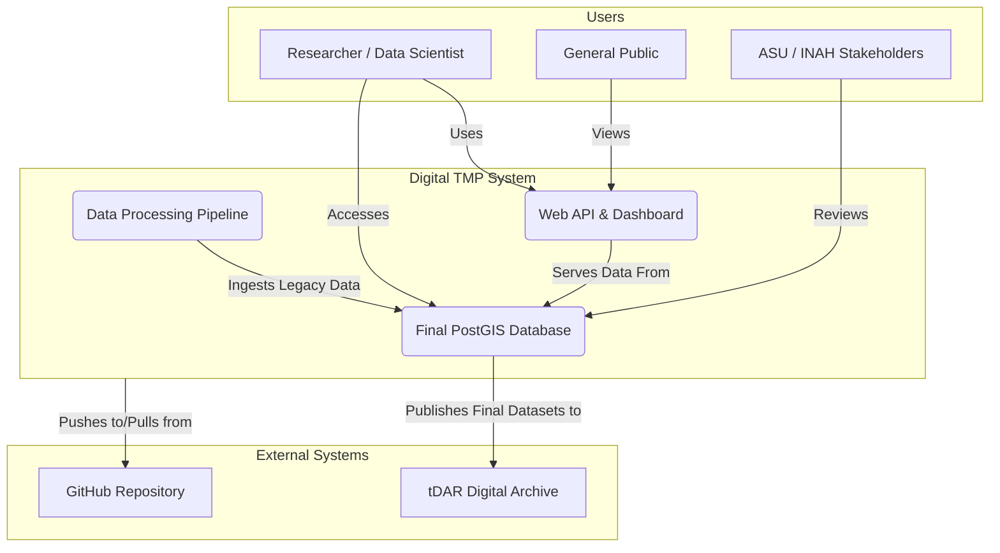
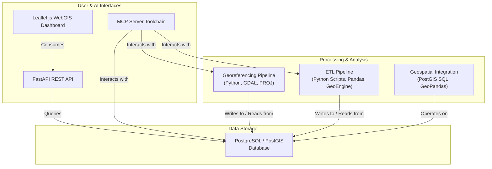
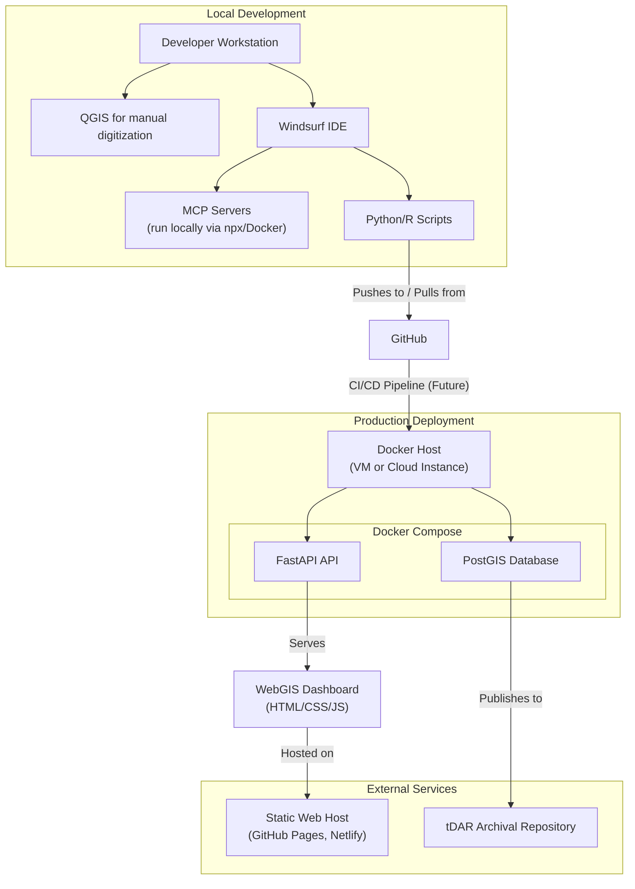
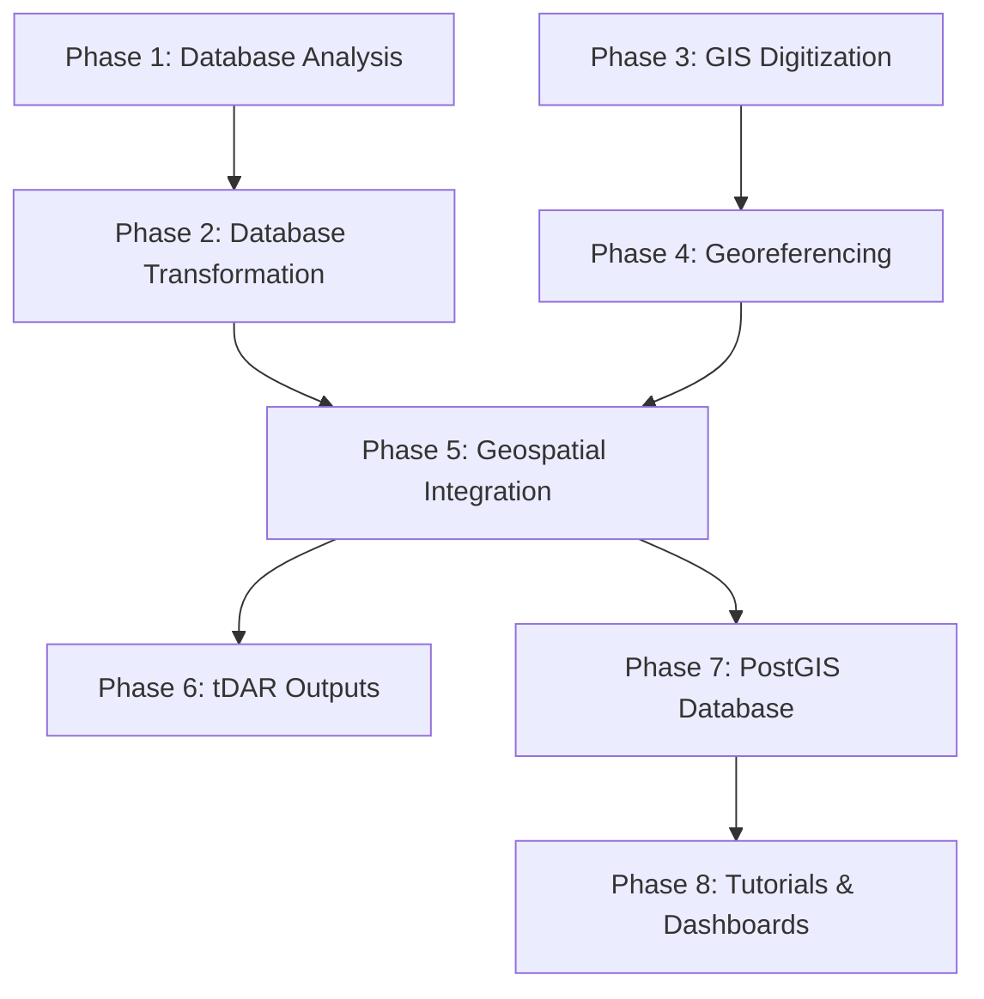

# Digital TMP - Project Architecture (Draft v2.0 -- 6/24/2025)

**Author:** Rudolf Cesaretti
**Affiliation:** ASU Teotihuacan Research Laboratory
**Date:** June 24, 2025
**Version:** v2.0

---

This project uses a modular structure based on three tiers:

- **Phases**: Major units of the project
- **Workflows**: Processes within each phase
- **Tasks**: Smallest unit of execution

---

## 1. Introduction and Overview

This document provides a comprehensive overview of the system architecture for the **Digital Teotihuacan Mapping Project (TMP) Integration Initiative**. It details the high-level structure of the project, the core components, the flow of data through the processing pipeline, and the key architectural principles and decisions that govern the system's design and implementation. This document is intended for the project developer and future technical collaborators who require a deep understanding of how the system is designed to function as a cohesive whole. It serves as the primary technical blueprint for the project.

This project progresses through eight (n = 8) methodologically distinct phases that systematically transform legacy archaeological databases into a modern, integrated geospatial data infrastructure. The architecture follows a data science pipeline approach, beginning with legacy database analysis and transformation (Phases 1–2), advancing through spatial data creation and georeferencing (Phases 3–4), achieving full geospatial integration with advanced feature engineering (Phase 5), preparing archival-ready outputs for long-term preservation (Phase 6), implementing a production-grade PostGIS database (Phase 7), and culminating in user-facing applications and comprehensive tutorials (Phase 8).

Each phase builds sequentially toward a fully reproducible, multi-format archaeological database that serves diverse stakeholder needs—from advanced researchers requiring programmatic access to public audiences seeking interactive visualization tools. The architecture emphasizes reproducibility, scalability, and interoperability, incorporating modern data science practices including automated validation, version control, containerized deployment, and comprehensive metadata management. The resulting infrastructure transforms the Teotihuacan Mapping Project's legacy data into a contemporary geospatial research platform while maintaining full provenance and enabling future extensibility.

The Digital TMP project architecture represents a comprehensive data modernization initiative that addresses the complex challenges of integrating legacy archaeological databases with contemporary geospatial technologies. The eight-phase approach ensures systematic quality control, maintains data provenance, and produces multiple distribution formats to serve diverse research and public engagement needs.

*   **Data Foundation (Phases 1-2)** establishes the analytical groundwork through rigorous evaluation of legacy MS Access databases, followed by systematic ETL processes that produce clean, analysis-ready datasets. These phases implement database profiling, schema optimization, and controlled vocabulary standardization to ensure data quality and analytical coherence.
*   **Spatial Data Creation (Phases 3-4)** addresses the manual digitization of archaeological features from historical maps and implements high-precision georeferencing workflows. These phases overcome the limitations of legacy cartographic materials through custom transformation pipelines and establish spatial accuracy standards for all subsequent analyses.
*   **Integration and Enhancement (Phase 5)** merges tabular and spatial datasets while implementing advanced feature engineering to derive new analytical variables. This phase leverages spatial relationships to enhance interpretive capacity and validates all integrated outputs through automated quality assurance protocols.
*   **Preservation and Distribution (Phases 6-8)** ensure long-term accessibility through multiple complementary approaches: formal archival submission to tDAR, deployment of a production-grade PostGIS database, and creation of user-friendly web applications. These phases balance preservation requirements with contemporary access patterns, providing pathways for both technical users requiring full analytical capabilities and public audiences seeking interactive exploration tools.

The architecture incorporates modern data science principles throughout, including reproducible computational environments (Docker containers), automated validation frameworks, version-controlled workflows, and comprehensive documentation standards. This approach ensures that the resulting infrastructure can accommodate future technological evolution while maintaining backward compatibility and data integrity.

## 2. System Overview Diagrams

The following diagrams provide a high-level visual representation of the system's architecture, its context, and its deployment model. They are intended to offer an immediate, intuitive understanding of the project's structure before delving into more detailed descriptions.

### 2.1 System Context Diagram

This diagram shows how the Digital TMP system interacts with its external users and other systems, defining its boundaries and primary interfaces.

### 2.2 Component Diagram

This diagram illustrates the major internal software components of the system and their primary relationships and dependencies.

### 2.3 Deployment Diagram

This diagram shows the planned physical or virtual deployment of the system's components across different environments.

## 3. Core Architectural Principles

The entire system is built upon the following guiding principles, which ensure its long-term viability, scientific rigor, and broader impact. These principles are synthesized from the project's core planning documents and serve as high-level constraints on all development work. These principles directly inform the design of the project's data architecture, which is detailed in the following section.

*   **Reproducibility**: All data transformations, analyses, and outputs must be fully reproducible. This is achieved through version-controlled code (Git), detailed documentation in code notebooks (Jupyter/RMarkdown), and the use of containerized environments (Docker) to ensure exact replication of the computational environment. Every script, query, and parameter setting is captured to allow any researcher to regenerate the final outputs from the original source data.
*   **Provenance Tracking**: The system must maintain a complete and traceable lineage for all data. Every step of data transformation, from original field records to final database entries, must be documented to ensure auditability and scholarly rigor. This principle is enacted through detailed transformation logs, versioned datasets, and comprehensive metadata that explicitly states the source and modification history of every data point.
*   **Quality Assurance**: The system must implement multi-stage validation to ensure data accuracy and integrity. This includes both automated frameworks (e.g., Great Expectations, `ST_IsValid` checks in PostGIS) and expert human review at critical junctures. This dual approach combines the scalability of automated checks with the domain-specific expertise required to identify subtle archaeological inconsistencies.
*   **Scalability**: The system must be designed to handle the full complexity and volume of the TMP dataset and accommodate future expansion. The architecture must allow for the integration of additional datasets (e.g., excavation data, LiDAR, GPR surveys) without requiring a complete redesign. This is achieved through a modular pipeline and an extensible database schema.
*   **Interoperability**: All outputs must conform to open, community-accepted standards for GIS and tabular data (e.g., GeoJSON, Shapefile, CSV, SQL). This ensures compatibility with a wide range of third-party tools (like QGIS, ArcGIS, R, and Python) and facilitates integration with other research contexts and international data-sharing initiatives.
*   **Accessibility**: The system must provide multiple, well-documented methods for data access to serve diverse stakeholder needs. This includes direct database access for technical users, downloadable datasets in standard formats for general use, and user-friendly web applications for public engagement and educational purposes.

## 4. Data Architecture

The project's data architecture is designed around a systematic transformation pipeline that converts fragmented, legacy data sources into a unified, analysis-ready, and spatially-enabled database. This architecture is the backbone of the entire project, ensuring that the final data products are robust, reliable, and scientifically valid.

### 4.1 Data Sources and Genealogy

The project's primary data sources are a collection of legacy digital assets produced by the Teotihuacan Mapping Project over several decades. Understanding their history and interrelationships is critical to understanding the architectural decisions of this project, particularly the challenges of integration and the necessity of the multi-phase pipeline.

*   **Main Attribute Databases (The "DF" Series):**
    *   **DF8 (Data File 8):** Created ca. 1975-1977, this was the first comprehensive research database, developed on a VAX mainframe. Its most consequential feature was the "merging" of ~5,500 original field collection tracts into ~5,046 analytical "cases," a process that was not always clearly documented and created lasting integration challenges that this project directly addresses.
    *   **DF9 (Data File 9):** Developed in the 1990s by Ian Robertson, this version represented a major architectural shift, migrating the data into a relational MS Access database. While this improved structure and reduced redundancy, the high degree of normalization proved inefficient for large-scale analytical queries common in modern data science.
    *   **DF10 (Data File 10):** The most recent version, developed by Anne Sherfield, restructured the database into a "long" or "tidy" format to reduce complexity and improve usability for modern analysis software like R and Python. This version serves as a key source for attribute data.

*   **Ceramic Reanalysis Database (REANS):**
    *   Initiated in the 1970s and 80s, the REANS database was a comprehensive reanalysis of the TMP ceramic collections, designed to capture more detailed typological and chronological information than was available in DF8.
    *   Crucially, REANS was recorded based on the *original, individual collection lots*, not the "merged" cases of DF8. This created a fundamental unit-of-analysis mismatch that is a primary challenge for this project to resolve, requiring careful cross-walking and validation in Phase 2.

*   **Geospatial Map Files (MF2 / MF3):**
    *   **MF2 (Map File 2):** The first digitized spatial framework, created by Ian Robertson in the 1990s, linking collection tract polygons to the attribute databases in the local "Millon Space" coordinate system.
    *   **MF3 (Map File 3):** A "topologically clean" version of MF2, which corrected geometric errors like polygon overlaps and gaps to ensure data integrity for advanced spatial analysis. This file forms the geometric basis for many of the project's spatial layers.

### 4.2 Data Model

The core data model is relational and geospatial. It evolves from the complex, multi-generational set of legacy MS Access databases into a final, unified schema within PostGIS. The key entities are archaeological survey collection units, architectural features, and ceramic analysis records.

The final data model, represented by the `TMP_DF12` and `TMP_REANs_DF4` datasets, is a denormalized, wide-format structure. This design was deliberately chosen based on the quantitative benchmarking performed in Phase 1, which demonstrated that a denormalized structure is significantly more performant for the types of large-scale analytical queries common in archaeological research. This model is then integrated with vector geospatial data (polygons, lines, points) representing the physical locations and shapes of these archaeological entities, creating a powerful analytical framework within the PostGIS environment.

### 4.3 Data Flow: The 8-Phase Pipeline

The data flows through a structured, eight-phase pipeline, ensuring traceability and quality control at each step. This workflow represents the primary architectural pattern of the project, moving data from raw legacy formats to a fully integrated, analysis-ready state.

#### Phase Overview Summary Table

| Phase | Description | Inputs | Outputs |
|-------|-------------|--------|---------|
| Phase 1: Database Analysis | Systematic evaluation and profiling of legacy TMP databases to inform optimal schema design and transformation strategies | 4 SQL Database Dumpt files written from comprehensive analysis of the original MS Access DBs | PostgreSQL migration, ERDs, schema profiling reports, denormalization white paper |
| Phase 2: Database Transformation | Comprehensive ETL and feature engineering to produce analysis-ready tabular datasets with standardized vocabularies | PostgreSQL tables, controlled vocabularies | TMP_DF12, TMP_REANs_DF4, transformation logs, validation reports |
| Phase 3: GIS Digitization | Manual digitization of archaeological, environmental, and modern features from historical raster maps | Raster basemaps, legacy documentation | Digitized vector layers, provisional attribute schemas, digitization metadata |
| Phase 4: Georeferencing | High-precision georeferencing using custom NTv2 transformations and spatial accuracy validation | Digitized vectors, GCPs, raster tiles | Spatially-aligned datasets, transformation grids, accuracy assessments |
| Phase 5: Geospatial Integration | Integration of tabular and spatial data with advanced feature engineering and architectural classification | GIS layers, TMP_DF12, REANs_DF4 | Fully integrated geospatial datasets, derived spatial attributes, classification schemes |
| Phase 6: tDAR Outputs | Preparation and packaging of archival-ready datasets with comprehensive metadata for long-term preservation | Integrated datasets, metadata | tDAR-compliant packages, controlled vocabularies, documentation, tutorials |
| Phase 7: PostGIS Database | Design and deployment of production-grade spatial database with optimized schemas and performance tuning | Integrated geospatial datasets | PostGIS database, Docker containers, SQL dumps, API endpoints |
| Phase 8: Tutorials & Dashboards | Development of user-facing applications and comprehensive tutorials for diverse analytical workflows | PostGIS database, static exports | WebGIS dashboard, REST API, Python/R/QGIS tutorials |

#### Phase Overview Flow Diagram

#### High-Level Phase Descriptions

1.  **Phase 1 - Database Analysis:** Legacy databases (DF8, DF9, DF10, REANS) are ingested into PostgreSQL for quantitative profiling. Denormalized "benchmark" databases are created to test the performance implications of different schema designs, providing an evidence-based justification for the final data model. ERDs are automatically generated to visualize legacy schemas.
2.  **Phase 2 - Database Transformation:** A comprehensive, staged ETL pipeline transforms and unifies the legacy tables into the final `TMP_DF12` (main attributes) and `TMP_REANs_DF4` (ceramic reanalysis) analysis-ready datasets. This phase includes intensive, variable-by-variable data cleaning, recoding, feature engineering, and the implementation of an automated data quality validation framework.
3.  **Phase 3 - GIS Digitization:** New, high-fidelity vector datasets are manually created by digitizing features from the two primary TMP map types: the Topographic Survey Map and the Architectural Reconstruction Map. This phase addresses significant gaps in previous digitization efforts, including finalizing all collection unit polygons and adding dozens of previously un-digitized feature types like floors, walls, modern land use annotations, and survey metadata.
4.  **Phase 4 - Georeferencing:** All vector and raster datasets are transformed from the local "Millon Space" to the project's target CRS, UTM Zone 14N (EPSG:32614). This is accomplished using a custom NTv2 grid shift file generated via a Thin Plate Spline (TPS) transformation based on over 1,900 Ground Control Points (GCPs), a method chosen specifically to handle the complex, non-linear distortions of the original maps.
5.  **Phase 5 - Geospatial Integration:** The transformed tabular data from Phase 2 is spatially joined with the georeferenced vector data from Phase 4 within the PostGIS database. Advanced geospatial feature engineering is performed to calculate new derived spatial attributes (e.g., structure density, proximity to features).
6.  **Phase 6 - tDAR Archival:** The final, validated datasets are packaged into archival-safe formats (Shapefile, GeoJSON, CSV) with comprehensive, multi-level metadata compliant with tDAR standards to ensure long-term preservation and discoverability.
7.  **Phase 7 - PostGIS Deployment:** A production-grade PostGIS database is designed and containerized with Docker. The final data is made available for reproducible deployment via both the Docker image and standard SQL dump files.
8.  **Phase 8 - Dissemination:** The finalized data is made accessible to a broad audience through multiple endpoints: a public-facing RESTful API (built with FastAPI), an interactive WebGIS dashboard (built with Leaflet.js), and a suite of comprehensive tutorials for common research workflows.

### 4.4 Data Provenance & Institutional Context

The data managed by this project exists within a specific institutional and collaborative framework that governs its stewardship, preservation, and dissemination.

*   **ASU Teotihuacan Research Laboratory**: Houses the original TMP datasets and facilitates ongoing research. The laboratory maintains both the physical and digital archives, serving as the primary steward of the data. Access to raw and intermediate data is managed via the institutional repository with controlled access protocols to protect the integrity of the primary records.
*   **Digital Antiquity/tDAR Partnership**: Serves as the official archival partner for long-term preservation and public dissemination of the final project outputs. This partnership ensures that all datasets are curated to meet community metadata and format standards (e.g., FAIR principles), and that they are assigned Digital Object Identifiers (DOIs) for stable and persistent citation.
*   **External Data Sources**: The project incorporates reference data from various external sources to provide geographic context and validation. This includes topographic reference data from INEGI (the Mexican national geographic institute), satellite imagery from various public and commercial providers for validating georeferencing, and comparative data from other academic archives.

### 4.5 Licensing & Permissions

The use and distribution of the project's data are governed by a clear set of licenses and permissions designed to promote academic research while respecting cultural heritage.

*   **Research Data**: The core TMP Datasets are permitted for academic use under the stewardship of the ASU Teotihuacan Research Laboratory. A fundamental requirement is that all uses must cite the original TMP investigators and the current Digital TMP project to ensure proper attribution. Derivative works are permitted for non-commercial research and educational purposes with the same attribution requirements.
*   **Reference Data**: The project incorporates public domain data, such as INEGI maps and US government satellite imagery (e.g., Landsat). Where commercially licensed high-resolution imagery is used for validation, it is not redistributed. The final outputs generated by this project (e.g., new vector layers, tutorials) are released under a Creative Commons Attribution (CC-BY) license to encourage broad reuse.
*   **Restrictions**: Certain datasets, particularly those containing precise location information for sensitive archaeological resources, are restricted to non-commercial academic research. As the data represents Indigenous cultural heritage of Mexico, respectful use is required, and all activities must comply with Mexican national heritage regulations, which may involve coordination with the Instituto Nacional de Antropología e Historia (INAH).

### 4.6 Known Data Quality Issues

A transparent understanding of legacy data challenges is fundamental to the project's architecture. The system is explicitly designed to mitigate these known issues.

*   **Legacy Database Issues**: The historical databases contain artifacts of their time, including character encoding inconsistencies (e.g., from EBCDIC to ASCII to modern UTF-8), approximately 300 REANs records that cannot be matched to a primary collection unit, and the "Total Counts Problem" where the sum of artifact counts in subdivisions exceeds the stated category total. Occasional transcription errors from decades of manual data entry are also present and are systematically flagged and corrected where possible during Phase 2.
*   **Spatial Data Challenges**: The original "Millon Space" coordinate system is non-standard and requires a custom transformation, which is the central task of Phase 4. Early digitization efforts varied in precision, and some legacy vector files contain topological issues like polygon overlaps and gaps, which are systematically cleaned in Phase 3.
*   **Temporal Inconsistencies**: The data collection spans over six decades (1962-2025), during which methodologies, technologies, and analytical frameworks evolved. For example, ceramic reclassifications performed in the REANS project are not always directly comparable to the original field classifications, a challenge addressed through careful documentation and the creation of controlled vocabularies in Phase 2.

## 5. Security Architecture

Given the sensitivity of archaeological data and the use of powerful development tools, the system's security architecture is designed to protect data confidentiality and ensure development environment integrity.

### 5.1 Security Requirements

*   **Data Confidentiality:** The system must be capable of handling sensitive archaeological data, specifically precise site location information, in a manner compliant with the spirit of the Archaeological Resources Protection Act (ARPA) and tDAR's policies for "confidential" information. This involves preventing unauthorized public disclosure of data that could put archaeological resources at risk.
*   **Development Environment Integrity:** The system must provide robust mechanisms to prevent unauthorized or accidental access to files and host systems outside the project's defined scope. This is particularly critical when utilizing powerful AI-driven automation tools (MCP toolchain) that have the potential to perform filesystem operations.

### 5.2 Security Measures

*   **Secrets Management:** All secrets, including database passwords, API keys, and digital signing keys, MUST be managed via environment variables or a future dedicated secrets management service (like HashiCorp Vault or AWS Secrets Manager). They must never be hardcoded into scripts or committed to the Git repository. This is a non-negotiable rule for all development.
*   **Filesystem Sandboxing:** The `desktop-commander` MCP tool, used for AI-assisted development, will be configured with the `DESKTOP_COMMANDER_ALLOWED_DIRS` environment variable. This creates a strict allow-list of directories (e.g., only the project repository root) where the tool can operate, effectively sandboxing AI agent filesystem operations and preventing accidental or malicious actions in other parts of the developer's system.
*   **Safe Database Access:** The `postgres-mcp` server provides configurable access modes to protect the database during development and automation. The `restricted` mode, which can enforce read-only access, set query execution time limits, and disallow destructive commands, will be the default for any automated or non-administrative connection. This prevents accidental data loss or corruption during the execution of complex ETL scripts.
*   **Archival Confidentiality:** The Phase 6 workflow for preparing tDAR outputs will strictly follow the repository's guidelines for confidential data. For any GIS files containing sensitive location information, a redacted, public version will be created (e.g., by generalizing geometries or removing precise coordinates). The complete, unredacted file will be uploaded separately and marked with the "confidential" access restriction in tDAR, making it available only to vetted researchers.

## 6. Performance and Scalability Architecture

The system is architected not only for correctness but also for high performance and future growth, ensuring it remains a valuable research tool for years to come.

### 6.1 Performance Optimization

The architecture incorporates several strategies to ensure the final database is highly performant for its intended analytical use cases, which often involve complex spatial queries and large-scale data aggregation.

*   **Upfront Benchmarking:** The decision to use a denormalized data model is not based on assumption but is justified by the quantitative benchmarking performed in Phase 1. This analysis directly compared query performance on the original normalized schemas versus denormalized "wide" tables, providing empirical evidence that denormalization offers significant speed improvements for typical archaeological queries.
*   **Database Indexing:** The PostGIS database design includes the systematic use of specialized indexes. **GIST (Generalized Search Tree)** indexes are created on all geometry columns to dramatically accelerate spatial queries (e.g., finding all artifacts within a specific structure). Standard **B-tree** indexes are used on primary keys and frequently queried attribute columns (e.g., `ssn` collection unit ID). For very large, ordered tables, **BRIN (Block Range INdexes)** may be used to provide a lightweight and efficient alternative.
*   **Materialized Views:** For computationally expensive queries that are run frequently, the architecture will use materialized views. These are essentially pre-computed tables that store the results of a complex query. For example, calculating artifact densities per collection unit, which requires joining and aggregating data from multiple tables, can be stored in a materialized view for near-instantaneous retrieval by the API or dashboard, rather than being re-calculated on every request.
*   **Lightweight Web Technologies:** The choice of FastAPI for the API and Leaflet.js for the dashboard prioritizes low overhead and fast response times for web-facing components. FastAPI is an asynchronous framework known for its high performance, while Leaflet.js is a lightweight mapping library with a small footprint, ensuring the public-facing tools are responsive and accessible.

### 6.2 Scalability Strategy

The architecture is explicitly designed to be scalable and extensible, anticipating that the TMP dataset will continue to grow and evolve.

*   **Modular Architecture:** The 8-phase pipeline is inherently modular. Each phase and its constituent workflows are self-contained scripts or processes. This allows individual components (e.g., a new ETL process for a newly discovered dataset) to be added or updated independently without requiring a full system redesign.
*   **Database Extensibility:** The PostgreSQL/PostGIS database is highly scalable and its relational schema is designed to be extensible. New tables representing future datasets (e.g., LiDAR-derived metrics, GPR anomalies, excavation data) can be easily added and linked to the existing core datasets via foreign keys (e.g., on the `ssn` collection unit ID), seamlessly integrating new research into the existing framework.
*   **Containerization:** The use of Docker for deploying the PostGIS database and API services ensures a scalable and reproducible environment. This approach allows the entire system to be deployed on more powerful hardware or scaled horizontally in a cloud environment (e.g., using Kubernetes) as project needs and user traffic grow.

## 7. Deployment Architecture

The deployment strategy is multi-faceted, designed to accommodate the different components of the system and serve the diverse needs of its user base, from local developers to the global research community.

*   **PostGIS Database Deployment:** The primary deployment method for technical users is via **Docker**. A `Dockerfile` and `docker-compose.yml` file are provided to build and run a container that encapsulates the fully configured PostgreSQL/PostGIS instance and the complete dataset. This is distributed via both the Docker image itself and standard SQL dump files (`pg_dump`), allowing for easy, one-command, reproducible deployment on any machine with Docker installed.
*   **MCP Server Tools Deployment:** The MCP servers that form the AI development toolchain are designed to be run locally during the development process. They are typically launched on-demand from the command line using **`npx`** (Node Package Execute), which fetches and runs the latest version of the tool without requiring a permanent local installation, simplifying dependency management.
*   **Web Applications Deployment (API & Dashboard):** The **RESTful API** (built with FastAPI) is designed to be deployed as a standard Python web application inside its own Docker container, separate from the database. This follows modern microservices principles. The **WebGIS Dashboard** (built with Leaflet.js) is a completely static web application (composed of HTML, CSS, and JavaScript files). This makes it extremely lightweight and cheap to host on any static site service, such as GitHub Pages or Netlify, ensuring long-term public availability with minimal maintenance.

## 8. Software and Technology

The project leverages a comprehensive technology stack combining industry-standard geospatial tools, modern data science frameworks, and cloud-native deployment strategies. Software selection prioritizes reproducibility, scalability, and long-term maintainability while ensuring compatibility with both research and archival infrastructure requirements.

| Phase | Core Technologies | Specialized Tools & Libraries |
|-------|-------------------|-------------------------------|
| **Phase 1: Database Analysis** | **PostgreSQL 17, Python 3.11+** | SQLAlchemy, psycopg2, Pandas, SQLParse (schema parsing), Graphviz (ERD generation), Jupyter Notebooks |
| **Phase 2: Database Transformation** | **PostgreSQL 17, Python 3.11+** | Pandas, GeoPandas, SQLAlchemy, Great Expectations (validation), dbt (optional), Jupyter Notebooks, regex libraries |
| **Phase 3: GIS Digitization** | **QGIS 3.40.5** | QGIS Topology Checker, Geometry Validation tools, Python (GeoPandas, Shapely) for QA/visualization |
| **Phase 4: Georeferencing** | **QGIS 3.40.5, GDAL 3.6+ (tested on 3.6.2 ▼ †), PROJ 9.0+** | QGIS Georeferencer, gdal_warp, gdal_translate, pyproj, custom NTv2 grid tools, spatial statistics libraries (R/Python) |
| **Phase 5: Geospatial Integration** | **PostgreSQL 17 + PostGIS 3.4, Python 3.11+** | GeoPandas, Shapely, psycopg2, rasterstats, QGIS (visualization), SQL spatial functions |
| **Phase 6: tDAR Outputs** | **PostgreSQL + PostGIS, GDAL, Python/R** | ogr2ogr, GeoPandas, sf (R), tidyverse (R), Pandoc (documentation), LaTeX/Markdown, 7-Zip |
| **Phase 7: PostGIS Database** | **PostgreSQL 17 + PostGIS 3.4, Docker** | ogr2ogr, raster2pgsql, psycopg2, SQLAlchemy, FastAPI, Docker Compose, pg_dump utilities |
| **Phase 8: Tutorials & Dashboards** | **FastAPI, Leaflet.js, Python 3.11+, R 4.3+** | Folium, Plotly, sf, ggplot2, tmap, DBI, RPostgreSQL, Jupyter Notebooks, RMarkdown, QGIS |

† GDAL 3.8+ offers marginal performance improvements and new drivers but is optional for this project.

### Technology Stack Rationale

*   **Database Infrastructure**: PostgreSQL with the PostGIS extension provides enterprise-grade spatial capabilities, ACID compliance for data integrity, and excellent performance for complex analytical queries. Version 17 is targeted for its enhanced spatial indexing capabilities and improved JSON handling, which is useful for metadata management.
*   **Geospatial Processing**: GDAL/OGR serves as the foundational command-line and library-level toolkit for all spatial data I/O and transformations, ensuring compatibility across a diverse range of formats. QGIS provides the essential graphical user interface for manual digitization, quality assurance visualization, and interactive georeferencing. All required functionality is fully supported on the **GDAL 3.6 series**; later versions (≥ 3.8) are advantageous only for optional utilities (e.g. `gdal_footprint`) or new web‑tile drivers and are therefore not mandated for core reproducibility.
*   **Programming Environments**: The Python ecosystem, with libraries like GeoPandas, Shapely, and Folium, offers a comprehensive and powerful environment for geospatial analysis and data manipulation. Concurrently, the R environment, with packages like sf and tidyverse, provides specialized and robust statistical and visualization tools favored in many academic disciplines, including archaeology. Both environments support reproducible research through literate programming in Jupyter Notebooks and RMarkdown.
*   **Deployment & Distribution**: Docker containerization is the cornerstone of reproducible deployment, ensuring that the database and API environments can be replicated exactly. FastAPI is chosen for its high performance, modern asynchronous capabilities, and automatic documentation generation, making it ideal for a lightweight API. Leaflet.js is selected for its simplicity, performance, and lack of external dependencies, enabling the creation of fast, cross-platform web maps.
*   **Data Quality & Validation**: Great Expectations and the optional use of dbt (Data Build Tool) provide structured, automated data validation frameworks that can be integrated directly into the ETL pipeline. These are supplemented by custom SQL constraints and functions within PostGIS (e.g., `ST_IsValid`) to enforce spatial and relational integrity throughout the data lifecycle.
*   **Archival Compatibility**: The selection of tools and output formats prioritizes long-term preservation requirements. By exporting final datasets to community-standard formats like Shapefile, GeoJSON, and CSV, the project ensures maximum compatibility with future technological environments and compliance with the archival standards of repositories like tDAR.

---

## 9. Detailed Phase-by-Phase Project Architecture

This section provides a granular, workflow-by-workflow breakdown of each of the eight project phases. Each phase is described in terms of its objectives, inputs, outputs, tools, and the specific sequence of workflows and tasks required for its completion. This represents the implementation-level blueprint for the project.

---

### Phase 1: Legacy Database Profiling & Architectural Analysis

**Description:**
This foundational phase focuses on the systematic, quantitative evaluation of the four legacy TMP databases (`DF8`, `DF9`, `DF10`, `REAN_DF2`) to produce actionable, data-driven insights that will inform their eventual transformation and integration. The architecture for this phase is organized into four distinct, sequential workflows that move from initial setup and data generation to final analysis and recommendation. Through an automated pipeline with database-specific performance benchmarking capabilities, this phase performs deep database profiling, generates structural visualizations, and conducts a rigorous quantitative analysis of the legacy schemas. The primary objective is to produce a defensible, evidence-based argument for the optimal target architecture for Phase 2. The outcomes directly inform schema redesign decisions, justify the project's denormalization strategy, and establish a reproducible technical baseline for validating all future data transformations. The final deliverable is a white paper that presents this evidence and formally recommends a unified, wide-format, analysis-ready database structure.

**Inputs:**

- **Legacy Database Dumps**: Complete SQL dump scripts for `TMP_DF8`, `TMP_DF9`, `TMP_DF10`, and `TMP_REAN_DF2`.
- **Corrected ETL Queries**: Two hand-authored SQL scripts (`flatten_df9.sql`, `flatten_df9_text_nulls.sql`) for transforming the `TMP_DF9` database into wide-format benchmarks.
- **Historical Documentation**: Any existing data dictionaries or notes associated with each legacy database.

**Outputs:**
- **PostgreSQL Databases**: Six fully instantiated local PostgreSQL databases (4 legacy, 2 benchmark).
- **Entity-Relationship Diagrams**: A set of high-quality SVG diagrams, including full-schema ERDs for all databases and focused, subsystem-level ERDs for the complex `TMP_DF9`.
- **Raw Quantitative Metrics**: A comprehensive set of granular metric files (~40 files) detailing every aspect of the databases, from table sizes to column-level data profiles. Persisted to `outputs/metrics/`.
- **Aggregated Summary Reports**: A machine-readable `comparison_matrix.csv` and a human-readable `comparison_report.md` that synthesize all raw metrics.
- **Executed Analytical Notebooks**: A set of six individual and one comparative Jupyter Notebooks containing all charts, tables, and analysis.
- **Denormalization White Paper (v3)**: The final narrative report presenting the quantitative justification for the recommended schema redesign.

**Tools & Techniques:**
- **Databases**: PostgreSQL (v17+)
- **Programming**: Python 3.11+
- **Core Python Libraries**: Pandas, SQLAlchemy, Psycopg2
- **Pipeline Scripts**: A suite of five orchestrator scripts (`00_` to `04_`) and a modular `profiling_modules` package with enhanced database-specific performance benchmarking.
- **Schema Visualization**: Graphviz
- **Analysis Environment**: Jupyter Notebooks with Plotly for interactive visualizations.

---

#### Workflow 1.1: Environment & Database Setup

**Overview:**
This initial workflow establishes the controlled, reproducible environment for the entire analytical phase. It automates the creation of PostgreSQL instances for all four legacy databases and, critically, generates two denormalized "benchmark" databases from the most complex legacy schema (`TMP_DF9`). These benchmarks serve as the performance baseline against which the legacy structures are quantitatively measured, forming the core of the argument for denormalization.

**Tasks:**
- **Design & Author SQL**: Design and author the complex ETL queries (`flatten_df9.sql`, `flatten_df9_text_nulls.sql`) required to transform the highly normalized `TMP_DF9` schema into analysis-ready wide-format tables, which will serve as performance benchmarks.
- **Develop Python Scripts**: Develop, document, and refine the robust, idempotent Python orchestration scripts (`00_setup_databases.py`, `01_create_benchmark_dbs.py`) responsible for automating all database creation and population tasks from the source SQL dumps.
- **Configure Environment**: Configure the `src/config.ini` file with the correct local PostgreSQL credentials and file paths for all inputs and outputs, ensuring the setup is portable.
- **Execute Database Instantiation**: Execute the `00_setup_databases.py` script to automatically create and populate the four legacy TMP databases from their source `.sql` dump files into a local PostgreSQL server.
- **Execute Benchmark Creation**: Execute the `01_create_benchmark_dbs.py` script to run the flattening queries against the newly created `TMP_DF9` database and generate the two wide-format benchmark databases (`tmp_benchmark_wide_numeric`, `tmp_benchmark_wide_text_nulls`).
- **Develop Test Suite**: Implement a formal `pytest` suite to unit-test the logic of the setup scripts, with a focus on configuration parsing, error handling, and successful database connection.
- **Validate Environment**: Conduct post-execution validation using a database client (e.g., `psql` or DBeaver) to confirm the successful creation and population of all six databases and their constituent tables, ensuring the environment is ready for the next workflow.

---

#### Workflow 1.2: Metric & Artifact Generation

**Overview:**
This workflow is the primary automated data-gathering engine of Phase 1. Using a modular and extensible `profiling_modules` package, a single orchestrator script connects to each of the six databases and executes a comprehensive suite of profiling tasks. This process gathers a rich dataset covering every aspect of the databases, from high-level statistics to granular, column-level data profiles. In parallel, a dedicated script generates visual diagrams of each schema.

**Tasks:**
- **Define Metrics**: Compile the exhaustive **Master List of Profiling Metrics** by synthesizing project requirements, data engineering best practices, and the specific analytical goals of the denormalization argument. This includes metrics on size, structure, completeness, and query performance.
- **Develop Profiling Engine**: Develop the modular `profiling_modules` Python package, creating distinct, testable modules for each category of metric (basic, schema, profile, interop, performance). This modularity allows for easy extension in the future.
- **Develop Orchestration Scripts**: Develop and document the main pipeline orchestrator (`02_run_profiling_pipeline.py`) and the enhanced ERD generation script (`03_generate_erds.py`), including logic for strategic, focused ERD creation for the most complex schemas.
- **Configure Dependencies**: Populate the `sql/canonical_queries/` directory with a metadata-driven set of database-specific benchmark queries. This schema-aware approach ensures fair and representative performance testing across disparate database structures. Ensure the external `Graphviz` dependency is installed and accessible in the system PATH.
- **Execute Profiling Pipeline**: Execute the `02_run_profiling_pipeline.py` script to systematically run all profiling functions against all six databases, generating the full set of raw metric files in `outputs/metrics/`.
- **Execute ERD Generation**: Execute the `03_generate_erds.py` script to produce all full-schema and focused, subsystem-level ERD diagrams in SVG format, providing a clear visual representation of the database structures.
- **Develop Test Suite**: Implement a comprehensive `pytest` suite for the `profiling_modules` package, using a temporary test database fixture to validate the correctness of each metric calculation function against known data.
- **Validate Outputs**: Verify the successful creation of all expected raw metric files (~40) and ERD diagrams (9) in their respective `outputs/` subdirectories, ensuring the data gathering was complete.

---

#### Workflow 1.3: Aggregation & Synthesis

**Overview:**
This workflow addresses the challenge of information overload by taking the dozens of granular metric files produced in the previous workflow and synthesizing them into concise, high-level reports. A discovery-driven script automatically finds and processes all available metric data, ensuring that the final reports are always synchronized with the generated data. This stage transforms the raw data into a format suitable for high-level comparison and analysis.

**Tasks:**
- **Design Aggregation Strategy**: Design a dynamic, discovery-driven aggregation strategy to synthesize numerous raw metric files into a cohesive summary. This involves mapping detailed metrics (e.g., row counts per table) to high-level reportable items (e.g., "Total Estimated Rows") for easy comparison.
- **Develop Synthesizer Script**: Develop and document the `04_run_comparison.py` script to automatically load, process, and aggregate all generated metrics. The script must be resilient, capable of handling any missing metric files from a partial pipeline run without failing.
- **Execute Aggregation**: Execute the `04_run_comparison.py` script to process all files in `outputs/metrics/`.
- **Generate Summary Reports**: The execution will produce the two key summary deliverables: `comparison_matrix.csv` (a machine-readable spreadsheet for further analysis) and `comparison_report.md` (a human-readable Markdown report for quick review).
- **Develop Test Suite**: Implement a `pytest` suite using a temporary file system fixture (`tmp_path`) to create fake input metric files and validate that the aggregation logic is correct and that the output reports are generated as expected.
- **Validate Reports**: Manually and programmatically inspect the generated `comparison_matrix.csv` and `comparison_report.md` files to ensure correctness, completeness, and proper formatting before they are used in the final analysis.

---

#### Workflow 1.4: Analysis, Reporting, & Recommendation

**Overview:**
This is the final, human-in-the-loop workflow where all the generated data, artifacts, and reports are brought together for interpretation and synthesis. Using a set of powerful Jupyter Notebook templates, the analyst performs deep-dive and comparative analyses to build the final, evidence-based argument and formal recommendation for the white paper.

**Tasks:**
- **Design Notebook Templates**: Design and develop two comprehensive Jupyter Notebook templates (`template_individual_db_analysis.ipynb`, `template_comparative_analysis.ipynb`) with pre-built data loading cells, advanced interactive visualizations (e.g., radar plots, performance factor charts), and guided analytical prompts to structure the analysis.
- **Execute Individual Analyses**: Utilize the individual analysis template by creating six copies and running each one to produce a detailed, standardized analytical report for each of the six databases, ensuring a consistent evaluation framework.
- **Execute Comparative Analysis**: Utilize the comparative analysis template to conduct the final cross-database comparison, synthesizing all results into a single, persuasive narrative that directly compares the legacy schemas to the denormalized benchmarks.
- **Perform Smoke Tests**: Implement automated "smoke tests" using `nbconvert` or `papermill` to ensure the notebook templates can execute from top to bottom without error against the real data, guaranteeing their robustness.
- **Synthesize Final Recommendation**: Perform the final human-in-the-loop analysis to interpret the generated visualizations, answer the analytical prompts in the notebooks, and formulate the final, data-driven recommendation for the Phase 2 architecture.
- **Draft Final White Paper**: Synthesize all quantitative findings, visualizations, and analytical narratives from the executed notebooks into a revised and expanded `Phase1_WhitePaper_v3.md`, solidifying the final architectural recommendation for a denormalized, wide-format data model.

---

### Phase 2: TMP Data Integration

**Description:**
Phase 2 focuses on the systematic consolidation and transformation of the legacy TMP datasets into a unified, analysis-ready relational framework. This process is executed in a staged approach, beginning with the integration of complementary information from three versions of the legacy database (DF8, DF9, DF10) to produce a provisional consolidated dataset (DF11). In addition, the REANs DF2 database is cleaned, redesigned and validated, to produce a provisional consolidated dataset (REANs DF3). Building upon this foundation, the phase advances to an intensive, variable-by-variable redesign and transformation of the integrated data, culminating in the final DF12 and REAN DF4 datasets. This process ensures that the resulting datasets are analytically robust, semantically coherent, and optimized for spatial integration and long-term archival dissemination. The phase concludes with the implementation of an automated metadata validation and data quality framework to enforce rigorous data integrity and documentation standards.

**Inputs:**

- Validated PostgreSQL instances of the legacy TMP databases (DF8, DF9, DF10).
- Schema profiling reports and ER diagrams produced in Phase 1.
- Historical data dictionaries and controlled vocabularies.
- Integration and transformation scripts developed during Phase 1.

**Outputs:**

- Provisional integrated dataset (DF11).
- Final analysis-ready dataset (DF12).
- Comprehensive controlled vocabulary glossaries and lookup tables.
- Detailed Variable Transformation Log documenting all modifications and engineering steps.
- Automated data validation and quality reports.

**Tools & Techniques:**

- PostgreSQL and PostGIS for data integration and relational management.
- Python (Pandas, GeoPandas, SQLAlchemy) for ETL scripting and variable transformation.
- Great Expectations or dbt for automated data quality validation.
- Jupyter Notebooks for reproducible data transformation workflows.
- Draw.io or Lucidchart for data model visualizations.

---

#### Workflow 2.1. Legacy Dataset Integration (DF8, DF9, DF10 → DF11; REAN DF2 → REAN DF3)

**Overview:**
This workflow performs the integration of complementary information from the three core legacy TMP database versions into a unified, provisional dataset (DF11). The process resolves schema inconsistencies, harmonizes attribute naming conventions, and ensures relational integrity across previously disparate datasets. This provisional dataset provides a coherent structural foundation for the subsequent redesign and analytical enhancement workflows.

**Tasks:**

- **Schema Alignment:** Conduct a thorough schema alignment by analyzing discrepancies between DF8, DF9, and DF10, using the recommendations, profiling reports, and ER diagrams from Phase 1 as a guide.
- **Data Flattening:** Flatten multi-table structures from the normalized legacy databases (especially DF9) into unified, wide-format tables that are more suitable for analysis.
- **REANs Cleaning:** Clean and validate the `REANs_DF2` database to resolve known inconsistencies, producing a cleaned provisional dataset, `REANs_DF3`.
- **Attribute Crosswalking:** Develop attribute crosswalk tables to standardize variable names, data types, and categorical value formats across the legacy datasets, using existing metadata tables and historical documentation.
- **Variable Reconciliation:** Reconcile and cross-validate overlapping or shared variables between datasets to create a single, authoritative version of each attribute.
- **Automated ETL:** Implement automated ETL pipelines in Python (using Pandas and SQLAlchemy) to merge the legacy datasets, ensuring data provenance is maintained through the addition of source-tracking fields.
- **Conflict Resolution:** Resolve duplicate records and structural conflicts using rule-based resolution strategies, prioritizing the most authoritative and complete data sources (e.g., preferring data from DF10 over DF8 where they conflict).
- **Archival:** Produce and archive the provisional `DF11` and `REANs_DF3` datasets along with detailed integration logs documenting all merging decisions and unresolved issues requiring future review.

---

#### Workflow 2.2. Variable Redesign and Analytical Transformation (DF11 → DF12; REAN DF3 → REAN DF4)

**Overview:**
This critical workflow undertakes a comprehensive, variable-by-variable redesign and transformation of the provisional DF11 and REAN_DF3 datasets to maximize their analytical utility. Variables are systematically evaluated for data quality, relevance, and interpretability. Transformation processes include cleaning, recoding, consolidation, and the engineering of new variables to reflect domain-relevant analytical concepts. The final output of this workflow is the DF12 and REAN_DF4 datasets, fully standardized and optimized for spatial and statistical analysis.

**Tasks:**
- **Variable Evaluation:** Conduct variable-level evaluations to assess data completeness, analytical significance, and redundancy, deciding which variables to keep, modify, or discard.
- **Feature Engineering:** Engineer new variables through consolidation and decomposition of complex fields, the creation of ordinal scales from nominal data, and the restructuring of categorical variables (e.g., aggregation, binning) to align with analytical frameworks.
- **Data Cleaning:** Clean or reformat text, categorical, and numeric fields. Apply advanced data cleaning techniques using regular expressions, string normalization, and programmatic logic to resolve legacy data inconsistencies (e.g., parsing and standardizing `site` and `subsite` designations).
- **New Variable Creation:** Introduce new analytic variables such as counts of sites, locations, and subsites per collection unit to enhance the interpretability of archaeological patterns.
- **Ordinal Transformation:** Transform nominal variables into ordinal scales where appropriate, enhancing their utility in statistical and machine learning models (e.g., recoding architectural quality variables from text descriptions to a numeric scale).
- **Variable Pruning:** Remove redundant, obsolete, or low-information variables, fully documenting all deletions and modifications in the Variable Transformation Log. This includes merging related variables, splitting overloaded columns, and dropping fields that are analytically irrelevant.
- **Schema Finalization:** Restructure column order and apply consistent, snake_case naming conventions to all fields.
- **REANs Finalization:** Clean `REAN_DF3`, perform variable redesign and metadata construction in the same manner as for DF11/DF12. Align the resulting `REAN_DF4` with `DF12` by the `ssn` (collection unit) key, leaving rows for unmatched SSNs as NULL to preserve the integrity of both datasets.
- **Final Output:** Produce the finalized `DF12` and `REAN_DF4` datasets, accompanied by complete transformation documentation and controlled vocabulary glossaries.

---

#### Workflow 2.3. Controlled Vocabulary Consolidation

**Overview:**
This workflow formalizes the controlled vocabularies applied to the DF12 and REAN_DF4 datasets, ensuring semantic consistency and analytical coherence across all categorical variables. These controlled vocabularies facilitate standardized data interpretation and support interoperability with external metadata schemas, including tDAR archival standards.

**Tasks:**

- **Vocabulary Consolidation:** Consolidate all unique categorical value sets from the legacy datasets into unified controlled vocabulary tables, resolving synonyms and standardizing terminology.
- **Vocabulary Application:** Apply the final vocabulary mappings to all categorical fields in the `DF12` & `REAN_DF4` datasets, ensuring consistency in terminology, spelling, and coding structures.
- **Glossary Production:** Produce comprehensive glossaries of the controlled vocabularies, formatted as both human-readable PDFs for documentation and structured CSV lookup tables for programmatic use in analysis and applications.
- **tDAR Alignment:** Ensure that the controlled vocabularies are aligned with tDAR metadata requirements and that all vocabulary documentation is referenced appropriately in the dataset metadata records prepared in Phase 6.

---

#### Workflow 2.4. Automated Metadata Validation & Data Quality Framework

**Overview:**
This workflow implements an automated framework for data validation and metadata compliance, integrating data quality assurance directly into the project’s ETL pipelines. The framework enforces schema integrity, relational consistency, and metadata completeness through the application of formal validation rules and automated reporting mechanisms. This ensures that the DF12 dataset and all future data products meet rigorous standards for analytical reliability and long-term reproducibility.

**Tasks:**

- **Framework Integration:** Integrate a data validation framework such as `Great Expectations` or `dbt` into the data transformation pipelines to enforce schema, content, and metadata compliance automatically.
- **Rule Definition:** Define a comprehensive suite of validation rules covering key integrity checks, including schema structure, variable-level constraints (e.g., not null, uniqueness, value ranges), and relational dependencies (e.g., foreign key enforcement between `DF12` and `REAN_DF4`).
- **Metadata Checks:** Automate metadata completeness checks, ensuring that all datasets are accompanied by fully populated metadata at the project, dataset, and file levels before they can be considered "complete".
- **CI/CD Integration:** Embed validation steps into a continuous integration/continuous deployment (CI/CD) workflow using tools like GitHub Actions. This will enforce automated data quality gates, preventing code that produces invalid data from being merged into the main branch.
- **Report Generation:** Generate reproducible data quality and profiling reports for each dataset release. These reports will be archived alongside the datasets to ensure transparency and auditability for future users.
- **Lineage Tracking:** Establish clear data lineage and transformation traceability through version-controlled logs and structured documentation, ensuring that all modifications to the data can be fully reconstructed and justified, in line with the core principle of Provenance Tracking.

---

### Phase 3: Geospatial Data Creation & Digitization

**Description:**
Phase 3 is dedicated to the manual creation of new geospatial vector datasets derived from previously non-existent spatial representations of critical archaeological and historical data. The digitized features include archaeological, environmental, and modern features from the Teotihuacan Mapping Project (TMP). Operating within a pre-georeferenced context, this phase focuses on the labor-intensive process of manually digitizing spatial features using QGIS, guided by assembled raster basemaps including scanned maps, aerial imagery, and legacy documentation. Because the original raster maps are not machine-readable and contain complex symbology, digitization was conducted manually using QGIS. The goal is to extract semantically meaningful features for spatial analysis, including archaeological structures, survey zones, land use classifications, and other field-recorded data. The primary objective of this phase is to produce high-fidelity provisional spatial layers that accurately represent archaeological site boundaries, architectural features, excavation units, and other relevant spatial phenomena documented by the TMP. These datasets will subsequently undergo georeferencing in Phase 4 and full spatial integration and attribute enrichment in Phase 5.

*****NOTE:*** *Due to the characteristics of the TMP raster maps, the digitization workflows undertaken in Phase 3 were largely performed manually using QGIS 3.40.5. As such, Workflows 3.2. and 3.3. can only be documented using text, tables and figures, as well as examination and visualization of their outputs (the digitized GIS layers) in Python or R.*

**Inputs:**

- Assembled raster basemaps (e.g., scanned survey maps, aerial photographs, historical site plans).
- Legacy TMP documentation and cartographic resources.
- Legacy TMP vector data layers (especially Sherfield's Architectural reconstruction polygons and Robertson's survey collection units)
- QGIS project templates for standardized digitization environments.

**Outputs:**

- Provisional vector datasets (polygons, lines, and points) representing TMP archaeological features.
- Cleaned and topologically validated shapefiles with standardized provisional attribute schemas.
- Digitization metadata records documenting source materials, accuracy considerations, and workflow decisions.

**Tools & Techniques:**

- QGIS 3.40.5 for manual digitization and spatial quality assurance.
- Raster basemap preprocessing using GDAL and QGIS Raster Tools.
- QGIS Topology Checker and Geometry Validation tools for pre-georeferencing QA.
- Structured file naming conventions and attribute schema templates for provisional shapefiles.
- Python (`geopandas`, `shapely`) for QA, visualization, and post-processing

---

#### Workflow 3.1: Raster Assembly for Digitization Context

**Overview:**
This workflow focuses on the preparation and assembly of raster basemaps that serve as the visual and contextual foundation for the digitization of new vector layers. These basemaps include a combination of scanned historical maps, aerial imagery, and previously undocumented legacy resources. Proper organization and preprocessing of these raster files are critical to ensure consistency and accuracy during the manual digitization process.

**Tasks:**

- **Data Collection:** Collect and catalog all relevant raster basemaps, including scanned TMP survey maps, excavation records, and aerial photographs from the ASU archives.
- **Raster Alignment:** Align and trim raster edges to unify coverage and create a seamless canvas for digitization.
- **Basemap Aggregation:** Aggregate individual raster tiles into two primary base layers: the `TMP_Topo_Survey_Raster` and the `TMP_Architectural_Reconstruction_Raster`.
- **Image Preprocessing:** Preprocess raster files using GDAL and QGIS to enhance visual clarity, adjust contrast, and remove scanning artifacts where possible.
- **QGIS Template Assembly:** Assemble QGIS project templates that overlay relevant basemaps, standardizing symbology, layer ordering, and digitization scales to ensure consistency across all digitization work.
- **Mosaic Export:** Export high-resolution mosaics of the assembled basemaps for efficient use during the digitization process.
- **Provenance Documentation:** Document the provenance of all raster sources, their original scale, and their intended use in the digitization workflows.

---

#### Workflow 3.2: Manual Digitization of Vector Layers from the TMP Topo/Survey Map

**Overview:**
This workflow carries out the manual creation of new vector datasets through detailed digitization of archaeological, survey, and environmental features visible from the Topo/Survey raster basemap. Digitization is performed systematically using QGIS, with careful attention paid to spatial accuracy, feature delineation, and provisional attribute consistency. Digitization is constrained by topological rules to maintain spatial validity.

**Tasks:**
- **Finalize Collection Units:** Edit and finalize the TMP collection unit polygon layer, ensuring all units are topologically correct and complete.
- **Digitize On-Site Features:** Manually digitize spatial features corresponding to 'on-site' archaeological phenomena, including: Floors, Walls, Taludes and Tableros, Plazas, Pits, Mounds, Stone concentrations, Sherd concentrations, Obsidian concentrations, Excavations, Staircases, and Sherd dumps.
- **Digitize Survey Annotations:** Manually digitize spatial features corresponding to 'off-site' zones and survey annotations, such as areas marked 'Not Surveyed' or 'No Permission', and survey tracts with 'Nada' (“N”) or 'Almost Nada' (“AN”) surface artifact densities.
- **Digitize Environmental/Modern Features:** Manually digitize spatial features corresponding to environmental and modern land use, including: Terraces, Tepetate outcrops, Drains, Dams, Borrow pits, Jagueys (reservoirs), Buildings, Built-up areas, Canals, rivers, barrancas, Roads, railroads, power lines, Alfalfa fields, Orchards, and areas noted as 'Levelled', 'Destroyed', 'Altered', 'Eroded', or 'Silted'.
- **Layer Organization:** Create separate vector layers for each thematic category (e.g., site boundaries, architectural features, excavation units) to maintain organizational clarity and facilitate targeted analysis.
- **Schema Application:** Apply provisional attribute schemas using standardized field names and data types to ensure consistency across all new vector layers.
- **File Naming:** Adopt structured file naming conventions to facilitate easy identification and version control of the provisional shapefiles.
- **Metadata Creation:** Produce provisional metadata records for each vector layer, noting the digitization scale, the source basemaps used, and any known uncertainties or interpretive decisions made during feature delineation.

---

#### Workflow 3.3. Manual Digitization of Vector Layers from the TMP Architectural Reconstructions Map

**Overview:**
This workflow carries out the manual editing of legacy vector datasets through detailed digitization of archaeological features from the Architectural Reconstructions raster basemap. This map shows architectural structures reconstructed from field data and historical interpretations. Digitization is performed systematically using QGIS, with careful attention to spatial accuracy, feature delineation, and provisional attribute consistency. It involves reconciling multiple versions of polygons, interpreting drawn annotations, and applying Sherfield’s classification scheme (e.g. “Map Assignations”). Digitization is constrained by topological rules to maintain spatial validity.

**Tasks:**
- **Load and Inspect:** Load and inspect the Architectural Reconstruction raster in QGIS to understand its symbology and content.
- **Analyze Differences:** Analyze the differences between various legacy architectural polygon versions to identify discrepancies and areas needing correction.
- **Polygon Re-digitization:** Implement a systematic re-digitization of Sherfield's 2023 line features in the urban core, converting them into polygons and applying Sherfield’s classification and zone boundary rules (the “Map Assignations System”).
- **Resolve Conflicts:** Resolve overlaps and inconsistencies between the newly digitized architectural layers and the layers digitized from the Topo/Survey map to create a cohesive spatial dataset.
- **Schema Application:** Apply provisional attribute schemas using standardized field names and data types to ensure consistency across all architectural vector layers.
- **File Naming:** Adopt structured file naming conventions for all edited and new architectural layers.
- **Metadata Creation:** Produce provisional metadata records for each vector layer, noting the digitization scale, source basemaps used, and any known uncertainties or interpretive decisions made during feature delineation.

---

#### Workflow 3.4: Pre-Georeferencing Metadata & Quality Assurance

**Overview:**
This workflow implements a set of quality assurance protocols to validate the structural integrity and internal consistency of the digitized vector datasets prior to georeferencing in Phase 4. Although the datasets do not yet possess real-world spatial reference systems, it is essential to ensure topological correctness and attribute schema standardization at this stage to facilitate efficient downstream processing.

**Tasks:**

- **Geometry Validation:** Perform geometry validation checks using the QGIS Geometry Validity and Topology Checker tools to identify and correct invalid geometries, such as self-intersecting polygons, dangles, or gaps between adjacent features.
- **Topological Correction:** Ensure that polygons are properly closed, lines are correctly snapped where appropriate (e.g., walls meeting at corners), and point features are accurately placed relative to basemap features.
- **Attribute Standardization:** Standardize provisional attribute fields across all vector layers, applying consistent field names, data types, and placeholder values as needed to prepare for the data joins in Phase 5.
- **Metadata Summaries:** Produce automated spatial metadata summaries documenting feature counts, geometry types, and bounding box extents (in the local coordinate space) for each provisional layer.
- **Archival:** Archive the validated provisional vector datasets and their metadata documentation in a version-controlled environment (Git LFS), preparing them for the georeferencing pipeline in Phase 4.

---

### Phase 4: Georeferencing

**Description:**
This phase develops and implements a high-precision georeferencing workflow to spatially align the digitized raster and vector layers produced in Phase 3. The process transforms data from the local, non-standard "Millon Space" to a modern, projected coordinate system (UTM Zone 14N). It incorporates a large set of ground control points (GCPs), advanced raster transformation techniques, the creation of a custom NTv2 grid shift file for maximum accuracy, and rigorous spatial error evaluation. The goal is to ensure that all spatial data layers can be integrated and cross-referenced with high spatial fidelity.

**Inputs:**
- Raster outputs from Phase 3 (Topo/Survey, Reconstruction maps) in "Millon Space".
- Manually collected GCPs linking "Millon Space" to a modern CRS.
- QGIS GCP layer and calibration outputs.

**Outputs:**
- Spatially-aligned raster layers in UTM Zone 14N (EPSG:32614).
- Transformation metadata (CRS definitions, NTv2 shift grids).
- Validated and georeferenced vector layers ready for integration.

**Tools & Techniques:**
- QGIS Georeferencer plugin
- GDAL Warp + gdal_translate
- PROJ custom CRS definitions
- Python (pyproj) and custom scripts for NTv2 grid generation.
- Spatial autocorrelation analysis (R, Python) for error assessment.

---

#### Workflow 4.1: Raster Pre-Processing and Ground Control Points (GCPs)

**Overview:**
This workflow focuses on preparing the data for the georeferencing of historical raster basemaps by using modern satellite imagery to create a dense set of Ground Control Points (GCPs) matched to the TMP Survey maps in Millon Space, and then manually testing their adequacy in QGIS.

**Tasks:**

- **Reference Data Setup:** Download, import, and set up the GCP-Reference Photogrammetry Raster Layers (e.g., high-resolution satellite imagery) that will be used for taking GCPs in a modern CRS.
- **GCP Collection:** Manually collect a high-density set of GCPs (~1900 points) in QGIS, identifying conjugate points between the unreferenced "Millon Space" rasters and the georeferenced satellite imagery. Export these points as a vector layer.
- **GCP Processing:** Import, read, and process the GCPs collected in QGIS, cleaning any obvious outliers and ensuring a good spatial distribution across the entire map area.
- **GDAL Formatting:** Convert the finalized GCPs to the GDAL-compatible format and attach them to the source raster basemaps.
- **Transformation Testing:** Test various projective transformations (e.g., polynomial, thin plate spline) using the GCPs and GDAL tools, employing Lanczos resampling to optimize image quality and minimize blurring during transformation.

---

#### Workflow 4.2: Raster Basemap Georeferencing Method Calibration and Optimization

**Overview:**
This workflow consolidates and refines the existing set of high-density GCPs, which form the foundation for all subsequent georeferencing transformations. High-order projective transformations and advanced resampling techniques are employed to minimize spatial distortion and preserve cartographic integrity. The process ensures that GCP datasets are free from outliers and adequately distributed to support high-accuracy spatial transformations. This workflow also implements formal spatial accuracy validation procedures to assess the effectiveness of the georeferencing transformations. Validation results are documented in technical reports, ensuring transparency and supporting confidence in the spatial integrity of all transformed datasets.

**Tasks:**

- **Sensitivity Analysis:** Conduct a sensitivity analysis to evaluate transformation performance under different interpolation (e.g., Thin Plate Spline, Polynomial) and resampling (e.g., Lanczos, Cubic Spline) methods.
- **Optimized Georeferencing:** Perform optimized raster georeferencing using `gdalwarp` with multithreading and parallel processing options to accelerate the transformation of the large basemaps.
- **Recursive Error Assessment:** Implement a recursive georeferencing error assessment and visualization process to compare the different methods.
    - Calculate the Root Mean Square Error (RMSE) across all GCP residuals to quantitatively measure the overall accuracy of each transformation method.
    - Produce spatial error heatmaps and residual vector plots to visually assess the distribution and magnitude of spatial errors, identifying areas of high distortion.
    - Conduct spatial autocorrelation analysis (e.g., Moran’s I) on the residuals to identify any non-random, systematic patterns in the spatial errors.
- **Method Selection:** Select the optimal georeferencing method (which was determined to be Thin Plate Spline for this project) via a final comparative analysis of method performance, documented in a technical report.
- **Raster Validation:** Validate the transformed rasters through side-by-side visual overlays in QGIS, ensuring alignment with known control features from modern imagery.
- **Metadata Documentation:** Document all transformation parameters and produce accompanying metadata records for the georeferenced rasters.

---

#### Workflow 4.3: Generation of Custom NTv2 Grid Shift Transformation Pipeline

**Overview:**
This critical workflow develops high-accuracy NTv2 grid shift transformation files (`.gsb`), enabling precise, reproducible georeferencing of both raster and vector datasets. This formalizes the transformation process, ensuring that all spatial data can be accurately transformed between Millon Space and modern coordinate systems without having to re-run the complex TPS transformation each time.

**Tasks:**
- **Define Custom CRS:** Define a custom Coordinate Reference System for 'Millon Space' using the PROJ library's WKT format. This formal definition is a prerequisite for the transformation pipeline.
- **Apply TPS Interpolation:** Apply the selected Thin Plate Spline (TPS) interpolation to the refined GCP dataset to model the complex, non-linear spatial distortions inherent in the Millon Space system.
- **Generate NTv2 Grid:** Generate the NTv2 grid shift files (`.gsb`) using GDAL tools and custom Python scripts that leverage the TPS model.
- **Register Grid Files:** Register the resulting `.gsb` files with the local PROJ and QGIS environments. This makes the custom transformation available natively within these tools.
- **Archive Transformation Files:** Include the final NTv2 transformation files as formal project deliverables, accompanied by technical documentation detailing their development, accuracy, and application.
- **Define PROJ Pipeline:** Define a custom transformation PROJ pipeline string that uses the custom 'Millon Space' CRS as the source and the NTv2 shift grid to transform to the target CRS (EPSG:32614).

---

#### Workflow 4.4: Vector Data Georeferencing Using NTv2 Transformations

**Overview:**
This workflow applies the custom NTv2 transformations to all provisional vector datasets created in Phase 3, converting them from "Millon Space" into a real-world coordinate system with high spatial accuracy. Following transformation, datasets are validated for geometry correctness and spatial integrity.

**Tasks:**
- **Apply Transformations:** Apply the NTv2 grid shift transformations to all provisional vector datasets using GDAL's `ogr2ogr` command-line tool or the `pyproj` library in Python, specifying the custom PROJ pipeline.
- **Post-Transformation Validation:** Perform post-transformation geometry validation using `ST_IsValid` in PostGIS or QGIS tools, correcting any invalid or anomalous geometries that may have resulted from the transformation process.
- **Standardize CRS:** Standardize the CRS definitions across all transformed datasets, formally assigning the target CRS (EPSG:32614) to all analytical outputs.
- **Archive Datasets:** Archive the transformed vector datasets and document all transformation parameters used for full reproducibility.

---

#### Workflow 4.5: Accuracy Assessment and Validation

**Overview:**
This workflow implements the final, formal spatial accuracy validation procedures to assess the effectiveness of the georeferencing transformations across all data. The results are documented in technical reports, ensuring transparency and supporting confidence in the spatial integrity of all transformed datasets.

**Tasks:**

- **Final Error Reporting:** Generate a final error assessment report with comprehensive diagnostics and visualizations.
    - Calculate the final Root Mean Square Error (RMSE) across all GCPs to provide a single, quantitative measure of the transformation's accuracy.
    - Produce final spatial error heatmaps and residual plots to visually document the distribution and magnitude of spatial errors for inclusion in project reports.
    - Conduct a final spatial autocorrelation analysis (e.g., Moran’s I) to confirm that no significant systematic errors remain in the final transformed data.
- **Report Compilation:** Compile all validation results into formal accuracy reports, which will be included as part of the project’s technical documentation deliverables for tDAR.
- **Corrective Actions:** If significant localized errors were detected, consider corrective rubber-sheeting for non-critical aesthetic layers, while clearly documenting that this was done and that analytical layers were not altered.

---

#### Workflow 4.6: Export of Georeferenced Datasets in Final CRSs

**Overview:**
This final workflow prepares all georeferenced datasets for distribution and analytical use. Production datasets are maintained in EPSG:32614 for advanced analysis, while final dissemination datasets are also exported in EPSG:4326 to ensure compatibility with WebGIS platforms and public data repositories.

**Tasks:**

- **Export Production Datasets:** Export the primary analytical datasets in the projected CRS **EPSG:32614 (UTM Zone 14N)** for use in the PostGIS environment and for researchers conducting spatial analysis requiring accurate area and distance measurements.
- **Export Dissemination Datasets:** Prepare public-facing datasets by reprojecting them to **EPSG:4326 (WGS 84)**, the standard for web mapping. This may involve simplifying geometries and compressing files for efficient WebGIS deployment and tDAR archival.
- **Metadata and Documentation:** Produce accompanying metadata and CRS transformation documentation for all exported datasets, clearly stating the CRS of each file.
- **Final Archival:** Archive the final, dual-CRS datasets in version-controlled repositories and prepare them for integration into the subsequent phases (5, 6, and 7).

---

### Phase 5: Geospatial Integration

**Description:**
Phase 5 establishes the spatial foundation for all downstream analytical and distributional workflows by integrating the cleaned, transformed non-spatial dataset (DF12) with its corresponding georeferenced spatial geometries. This process yields a unified, fully spatialized dataset (DF13) that is both analytically enriched and technically prepared for inclusion in geospatial infrastructures such as the PostGIS database (Phase 7), archival systems (Phase 6), and interactive web applications (Phase 8). In addition to attribute-spatial joining, this phase introduces derived spatial attributes through spatial feature engineering and the incorporation of relevant external GIS layers. The final outputs are comprehensively validated and exported in both internal and dissemination-ready coordinate reference systems, ensuring analytical robustness and interoperability.

**Inputs:**

- `DF12` and `REANs_DF4`: Final transformed non-spatial relational datasets from Phase 2.
- Georeferenced vector layers from Phase 4 (in EPSG:32614).
- External GIS datasets (e.g., DEMs, infrastructure layers, land cover).
- QGIS project templates and layer symbology guides.

**Outputs:**

- Fully integrated spatial dataset (`DF13`) with analytical attributes and geometry.
- Final classification of architectural features polygons via spatial cross-referencing against the underlying spatially-integrated DF12 architectural interpretations data.
- Updated version of `DF12` with new and updated spatial variables.
- Spatial metadata records and join documentation for reproducibility.

**Tools & Techniques:**

- PostgreSQL 17 + PostGIS 3.4
- QGIS and GDAL for visualization and spatial layer management.
- Python for database operations (`psycopg2`, `pandas`, `shapely`) and spatial analysis/transformation (`GeoPandas`, `rasterstats`, `pyproj`).
- SQL (PostGIS functions) for spatial feature engineering and validation.

---

#### Workflow 5.1. GIS Integration

**Overview:**
This workflow merges all digitized spatial features with the core TMP collection units and their rich tabular datasets. It aligns the attribute tables (`DF12`, `REANs_DF4`) with the primary geospatial layer (collection unit polygons) to create a single, powerful analytical dataset.

**Tasks:**
- **Preliminary Validation:** Perform a final validation and QA check of all incoming spatial data layers, reconciling any remaining overlapping or duplicate geometries before integration.
- **Spatial Join:** Join the `TMP_DF12` and `TMP_REANs_DF4` tabular datasets to the georeferenced TMP survey collection unit polygon layer using the `ssn` field as the primary key. This creates the core integrated spatial dataset, provisionally named `DF13`.

---

#### Workflow 5.2. Architectural Feature Classification

**Overview:**
This workflow involves the final classification of the architectural features polygons (digitized in Phase 3) via spatial overlays against the underlying, newly integrated `DF13` data. This process uses the rich architectural and functional interpretation data from `DF12` to assign meaningful classifications to the geometric shapes, enhancing their interpretability and analytical depth.

**Tasks:**
- **Define Classification Schema:** Define a hierarchical architectural-functional interpretation classification schema based on the variables available in `DF12`.
- **Construct Classification Algorithm:** Analyze the data to construct a classification algorithm based on the collection unit's architectural and functional interpretations. This will likely involve a set of heuristic rules.
- **Spatial Cross-Referencing:** Spatially cross-reference the architectural feature polygons with the `DF13` collection unit polygons. This will create a one-to-many link between architectural features and the collection units they fall within.
- **Calculate Proportional Overlaps:** For features that span multiple collection units, calculate proportional overlaps or other weighting schemes to determine the most likely classification.
- **Align with Prior Schemes:** Compare and align the new, algorithmically-derived classifications with existing or prior architectural classification schemes (e.g., Sherfield's "Map Assignations"), and create a new field to denote structures whose classification has changed.
- **Attribute Enrichment (Optional):** Consider adding derived fields from `TMP_DF12`/`REANs_DF4` to the architectural features layer based on proportional weightings.
- **Update Metadata:** Create and update the metadata for the revised architectural feature polygon layer to reflect the new classification schema and methodology.

---

#### Workflow 5.3. Geospatial Feature Engineering

**Overview:**
This workflow enriches the integrated dataset through the creation of derived spatial attributes that are relevant for archaeological analysis. These include geometric measurements, locational descriptors, and spatial complexity indicators, which are calculated using PostGIS functions and Python scripts.

**Tasks:**
- **Compute Geometric Metrics:** Compute geometry-derived metrics for all relevant polygon layers, such as area (in square meters), perimeter, shape complexity indices (e.g., perimeter-to-area ratio), adjacency measures, and other topological characteristics.
- **Generate Density Metrics:** Generate spatial entropy and density metrics to capture the spatial heterogeneity of archaeological phenomena, such as artifact density per collection unit or structure density per square kilometer.
- **Add Spatially-Derived Variables:** Add new, explicitly spatial variables to the attribute tables, such as the X and Y coordinates of polygon centroids in multiple CRSs. Quantify GIS features within each collection unit (e.g., count of wall segments, total area of floors).
- **Revise Existing Variables:** Revise existing spatial metadata variables (e.g., legacy coordinate fields) to ensure they are consistent with the new, high-precision georeferenced data.
- **Cross-Validation:** Compare the newly derived spatial data fields to the original TMP values recorded in the legacy databases. Flag significant inconsistencies or errors for review and potential revision.
- **Refine and Correct:** Cross-validate and refine/edit/correct original TMP variables using the new GIS features data (e.g., comparing the count of structures recorded in the database to the count of digitized structure polygons).
- **Export Derived Features:** Export all newly derived features as persistent attributes in the final `DF13` dataset and document them thoroughly in an updated data dictionary.

---

#### Workflow 5.4. Spatial QA and Export

**Overview:**
This final workflow validates the fully integrated and enriched spatial dataset and prepares it for archival (Phase 6), dissemination (Phase 8), and final database deployment (Phase 7). It ensures internal consistency, CRS uniformity, and completeness of all metadata.

**Tasks:**
- **Final Validation:** Conduct final geometry and attribute validations on the `DF13` and other integrated layers to ensure no errors were introduced during the feature engineering process.
- **CRS Consistency:** Ensure all final spatial layers are correctly projected and their CRS information is properly encoded.
- **Metadata Production:** Produce comprehensive spatial metadata records for all final datasets, summarizing their geometric properties, attribute schema, CRS history, and the results of the integration and feature engineering processes.
- **Archive for Next Phases:** Archive the final, validated datasets alongside their full documentation in a version-controlled repository, marking them as ready for use in Phase 6 (tDAR Outputs) and for deployment in the final PostGIS database in Phase 7.

---

### Phase 6: tDAR Outputs

**Description:**
Phase 6 focuses on the preparation, transformation, and packaging of the project’s spatial and non-spatial datasets for long-term archival and dissemination through The Digital Archaeological Record (tDAR). Given tDAR’s emphasis on data preservation, discoverability, and accessibility, this phase ensures that all data products meet strict archival standards and are accompanied by comprehensive metadata and documentation. Special attention is given to overcoming format limitations inherent in archival platforms—particularly the ESRI Shapefile—and ensuring that data remain usable and intelligible to future researchers across disciplines.

**Inputs:**

- Fully processed spatial and non-spatial datasets from Phases 1–5.
- Controlled vocabularies and ontological frameworks developed during data integration and schema design.
- Methodological reports, technical documentation, and data dictionaries produced throughout the project lifecycle.

**Outputs:**

- Archival-ready datasets converted into tDAR-compliant formats, including Shapefiles, CSV files, and compressed GeoTIFF subsets.
- Complete metadata documentation at the project, dataset, and file levels.
- Supporting controlled vocabulary files and explanatory glossaries.
- External repository links for datasets exceeding tDAR’s file size limitations, accompanied by persistent DOIs.
- User tutorials and technical guides to facilitate dataset integration and reuse.

**Tools & Techniques:**

- PostgreSQL/PostGIS for final spatial data validation and export.
- GDAL and ogr2ogr for format conversion and CRS standardization.
- QGIS for spatial data visualization, clipping, and validation.
- Python (GeoPandas, Pandas, psycopg2) and R (sf, tidyverse) for automated data transformations and controlled vocabulary preparation.
- LaTeX/Markdown for structured documentation; Draw.io for producing schema and relationship diagrams.
- Zenodo and Figshare for hosting large datasets not suitable for direct tDAR upload.

---

#### Workflow 6.1. Data Preparation & Transformation

**Overview:**
This workflow addresses the conversion of finalized datasets into archival-safe, tDAR-compliant formats. Given the technical limitations of ESRI Shapefiles, particularly with respect to attribute field length restrictions (10 characters) and data types, the workflow includes the development of supplementary CSV tables and attribute crosswalks to preserve the completeness of the original datasets.

**Tasks:**

- **Shapefile Transformation:** Transform spatial vector datasets into the Shapefile format using `ogr2ogr`. This process will apply standardized field name truncation protocols to meet the 10-character limit and create detailed attribute name crosswalks mapping the truncated names back to the full, descriptive names.
- **Linked CSV Production:** Produce linked CSV files containing the full, untruncated attribute tables that cannot be accommodated directly within the Shapefiles. Each CSV will include the unique identifier (e.g., `ssn`) to allow for relational joining by the end-user.
- **Raster Subsetting:** Clip and compress large GeoTIFF raster datasets to create thematically focused, size-constrained subsets suitable for archival upload. For example, creating separate GeoTIFFs for different map layers or regions.
- **Derived Raster Generation:** Where appropriate, generate derived raster products representing analytical results (e.g., a heatmap of artifact density) rather than archiving the raw, multi-gigabyte imagery, further reducing file sizes while preserving interpretive value.
- **Final Validation:** Validate all spatial data geometries and coordinate reference systems one last time using PostGIS and QGIS tools to ensure they comply with archival quality standards before packaging.

---

#### Workflow 6.2. Metadata and Ontology Preparation

**Overview:**
This workflow focuses on the systematic creation of metadata and the preparation of controlled vocabularies to accompany all datasets submitted to tDAR. Comprehensive metadata ensures that future users can accurately interpret the datasets, understand their provenance, and integrate them into new research contexts. While tDAR does not directly support formal ontological models, this project provides controlled vocabularies and glossaries in CSV and PDF formats to maintain semantic clarity and consistency across all archived materials.

**Tasks:**

- **Project-Level Metadata:** Prepare project-level metadata capturing the overarching research context, spatial and temporal coverage, investigation types, funding sources, and cultural affiliations, to be entered into the tDAR project page.
- **Dataset-Level Metadata:** Develop dataset-level metadata for each distinct data package, documenting the dataset's contents, specific spatial coverage, data collection methodologies, file formats, and creator attribution.
- **File-Level Metadata:** Create file-level metadata for each individual file, including detailed descriptions of the file's content, its specific spatial reference system, its data schema, and detailed variable definitions.
- **Controlled Vocabulary Files:** Produce standalone CSV files for all controlled vocabularies used within the datasets (e.g., material types, artifact classifications, architectural feature categories) for users to download.
- **Glossary and Crosswalk Document:** Generate a comprehensive glossary document (in PDF format) that maps the abbreviated attribute field names used in Shapefiles back to their full descriptive names, supplemented by detailed explanations of each variable. This is a critical piece of documentation.
- **Visual ERDs:** Create visual entity-relationship diagrams (ERDs) using Draw.io or equivalent software, illustrating the relationships between the different datasets (e.g., how the Shapefiles link to the CSVs) to assist users in reconstructing the complex data relationships.

---

#### Workflow 6.3. Documentation & Tutorial Development

**Overview:**
This workflow addresses the creation of comprehensive documentation and instructional materials to accompany all archived datasets. These resources serve to enhance dataset transparency, facilitate effective reuse, and ensure that both technical and non-technical audiences can understand and work with the archived materials. In addition to formal project documentation, this workflow emphasizes the creation of user-centered tutorials and guides for integrating, visualizing, and analyzing the datasets using common GIS and statistical platforms.

**Tasks:**

- **Draft ReadMe Files:** Draft clear and concise ReadMe files for each dataset package, providing overviews of the dataset's contents, file structures, and essential usage recommendations.
- **Develop Data Dictionaries:** Develop detailed data dictionaries documenting all variables contained in the datasets, including the truncated and full variable names, full descriptions, data types, units of measurement, and any applicable value codes.
- **Methodological Report:** Prepare a final methodological report detailing data collection protocols, processing workflows, analytical transformations, and known data limitations, ensuring full transparency regarding dataset provenance.
- **Provenance and Versioning Report:** Produce a provenance and versioning report that documents changes across dataset iterations, provides a clear version history, and specifies the recommended citation formats for the data.
- **Re-joining Tutorials:** Create simple, step-by-step tutorials for rejoining the supplementary CSV attribute tables with the Shapefiles using both QGIS and ArcGIS, including annotated screenshots.
- **"Quick Start" Guides:** Develop concise “Quick Start” guides for loading and exploring the datasets in common GIS environments, highlighting key analytical workflows and visualization options.
- **Visual Supplements:** Where possible, produce visual supplements such as slide decks or brief instructional videos to further support dataset comprehension and use.

---

#### Workflow 6.4. Packaging & Distribution

**Overview:**
This workflow finalizes the preparation of all datasets and documentation for distribution through tDAR and supplementary repositories. Given the platform’s limitations regarding file sizes and supported formats, this workflow ensures that datasets are logically organized, appropriately compressed, and clearly documented. For large datasets that cannot be hosted directly on tDAR, external repositories are utilized, and persistent identifiers are generated to ensure permanent discoverability and citation. This ensures that the full scope and resolution of the project’s outputs remain accessible while complying with tDAR’s preservation requirements.

**Tasks:**
- **Standardize Naming Conventions:** Establish and apply a standardized, versioned naming convention for all files and folders to facilitate clarity and long-term data management.
- **Organize Archival Packages:** Organize datasets into logical archival packages, bundling the spatial data (Shapefile), attribute data (CSV), metadata, controlled vocabularies, and supporting documentation into cohesive, self-contained units.
- **Compress Packages:** Utilize 7-Zip or a comparable archival tool to produce compressed, preservation-ready submission packages (`.zip` or `.7z`), ensuring all accompanying documentation is included within the archive.
- **Direct tDAR Upload:** Upload datasets that are compliant with tDAR’s file size and format requirements (Shapefiles, CSVs, clipped/derived GeoTIFFs, PDF documentation) directly to the platform, completing all necessary metadata fields during the submission process.
- **External Repository Hosting:** For datasets exceeding tDAR’s limitations (e.g., full-resolution raster mosaics), upload the files to an external repository such as Zenodo or Figshare. Generate persistent DOIs for these external assets and reference these identifiers clearly in the tDAR metadata records.
- **Final Review:** Conduct a final, thorough review of all uploaded materials to ensure the completeness and accuracy of metadata, documentation, and dataset accessibility before finalizing the tDAR submissions and making them public.

---

### Phase 7: PostGIS Database

**Description:**
This phase entails the design, implementation, and deployment of a PostGIS-enabled relational database to serve as the analytical and distributional backend for the project. The database will integrate previously processed geospatial datasets and metadata, enabling complex spatial queries, analytical workflows, and efficient data dissemination through multiple distribution mechanisms. This architecture ensures both reproducibility for advanced research users and accessibility for public stakeholders.

**Inputs:**
- Integrated geospatial datasets and metadata from preceding project phases.
- Controlled vocabularies and ontological structures derived from tDAR outputs.

**Outputs:**
- Operational PostGIS TMP Database with fully integrated spatial and non-spatial data.
- Packaged database deliverables, including a Docker container, SQL dump files, and public-friendly static file exports (GeoJSON, CSV, GeoTIFF).
- API endpoints and an interactive WebGIS dashboard providing curated access to project data.

**Tools & Techniques:**
- PostgreSQL with PostGIS Extension
- Docker for containerized deployment and reproducibility
- `ogr2ogr` and `raster2pgsql` for efficient data import processes
- `psycopg2`, `SQLAlchemy`, and `GeoPandas` for programmatic data handling
- FastAPI for RESTful API development
- Leaflet.js for WebGIS Dashboard implementation

---

#### Workflow 7.1. PostGIS Database Design & Setup

**Overview:**
This workflow focuses on the conceptualization and construction of the PostGIS database schema, incorporating both spatial and non-spatial datasets. The design process emphasizes relational integrity, spatial indexing for optimized query performance, and alignment with metadata structures derived from tDAR ontologies. The resulting schema will support advanced spatial analyses while remaining accessible for integration with external tools and public dissemination platforms.

**Tasks:**

- **Identify Spatial Entities:** Identify and define the primary spatial entities relevant to the project, including but not limited to archaeological sites, artifacts, excavation units, surveys, and architectural features.
- **Integrate Controlled Vocabularies:** Integrate the metadata and controlled vocabularies from tDAR as reference and lookup tables to ensure standardized data categorization and semantic consistency within the database.
- **Develop Schema:** Develop a normalized relational schema that supports efficient data storage while minimizing redundancy. Where appropriate, selectively denormalize data structures or create views to enhance read performance for anticipated analytical workloads.
- **Implement Spatial Indexing:** Implement spatial indexing strategies using GIST indexes on all geometry columns and BRIN indexes for handling large, ordered datasets to dramatically improve query efficiency.
- **Enforce Constraints:** Establish primary key and foreign key constraints to enforce relational integrity and support robust spatial joins and aggregations between tables.
- **Implement Topology (If Needed):** Where complex spatial topologies are required (e.g., for network analysis of streets), implement PostGIS Topology models to accurately represent hierarchical and adjacency relationships between spatial features.
- **Create Views:** Create standard SQL views and materialized views to simplify frequent and computationally intensive queries, facilitating faster access to common analytical results for the API and other clients.

---

#### Workflow 7.2. PostGIS Database Construction & Validation

**Overview:**
This workflow addresses the practical implementation of the database schema and the systematic ingestion of spatial and non-spatial datasets. The process ensures that all data are spatially enabled, properly validated, and optimized for analytical and distributional purposes. Validation procedures are incorporated to maintain data integrity, while performance optimization focuses on efficient query execution and resource utilization.

**Tasks:**

- **Initialize Database:** Initialize the PostgreSQL database instance and enable the necessary PostGIS extensions, including `postgis` for spatial data types and functions, and potentially `pgrouting` for advanced spatial network analysis if applicable.
- **Load Tabular Data:** Load the Phase 2 outputs (`TMP_DF12` and `TMP_REANs_DF4`) as standard tables.
- **Load Spatial Data:** Import all Phase 3–5 GIS layers as PostGIS geometry tables, using `ogr2ogr` for vector datasets (preferably from a GeoPackage source) and `raster2pgsql` for raster datasets. Apply tiling during raster imports to improve query performance and rendering efficiency.
- **Spatially Enable Tables:** Spatially enable the main data tables by joining them with the appropriate geometry layers (e.g., joining `TMP_DF12` to the collection unit polygons).
- **CRS Validation:** Conduct thorough coordinate reference system (CRS) validation, ensuring that all datasets are transformed to a unified spatial reference system (EPSG:32614) using `ST_Transform`.
- **Create Indexes:** Establish spatial indexes using GIST on all geometry columns and B-tree/BRIN indexes on primary keys and frequently queried attribute columns to facilitate efficient queries.
- **Define Constraints:** Define and enforce database constraints, including NOT NULL, UNIQUE, and FOREIGN KEY constraints, to maintain data integrity and prevent relational inconsistencies.
- **Validate Geometries:** Validate all spatial geometries using the PostGIS function `ST_IsValid` and repair any invalid geometries using `ST_MakeValid`.
- **Performance Tuning:** Perform query profiling and optimization using `EXPLAIN ANALYZE` to identify performance bottlenecks. Create or refresh materialized views for high-demand analytical queries to reduce computation time during data access.

---

#### Workflow 7.3. PostGIS Database Packaging & Distribution

**Overview:**
This workflow ensures that the completed PostGIS database is systematically packaged and distributed to accommodate diverse user needs, including researchers requiring full analytical capabilities and public users seeking simplified access to project data. Multiple distribution strategies are implemented to balance technical accessibility, long-term reproducibility, and ease of integration with existing analytical workflows and visualization platforms.

**Tasks:**

**A. Packaging for Technical Users**
- **Generate SQL Dumps:** Generate comprehensive SQL dump files using `pg_dump`:
  - `schema_only.sql`: Provides a lightweight, structural reference for users who wish to explore or extend the database schema without large data transfers.
  - `full_data.sql`: Delivers a complete, versioned snapshot of the database including all spatial and non-spatial records for advanced research use.
- **Develop Docker Container:** Develop a Docker container that includes the fully configured PostgreSQL/PostGIS instance and is populated with the data from the `full_data.sql` dump. This container ensures exact replication of the database environment, facilitating long-term reproducibility and ease of deployment.
- **Provide Documentation:** Provide detailed deployment documentation, including Docker Compose files and restoration scripts, to support rapid, one-command deployment by technical users.

**B. Packaging for Non-Technical and Public Users**
- **Export Static Datasets:** Export key spatial datasets in widely supported static formats, including GeoJSON and CSV for vector data and GeoTIFF for raster data, using `ogr2ogr` and standard SQL queries.
- **Package Static Files:** Package these static datasets with accompanying metadata documentation, including descriptions of file contents, coordinate reference systems, data provenance, and version history.
- **Organize Archives:** Organize the static files into versioned archival packages (`.zip`) to facilitate easy download, citation, and long-term reference.

**C. API and Web-Based Access**
- **Deploy RESTful API:** Deploy a lightweight RESTful API using FastAPI to serve curated datasets in GeoJSON and CSV formats. This enables programmatic access to key project data without requiring users to download or run the full database.
- **Build WebGIS Dashboard:** Build and deploy an interactive WebGIS dashboard using Leaflet.js. This dashboard will provide map-based visualization of key spatial datasets and will be powered by the API. It will include data filtering capabilities, interactive querying, and direct download links for the static datasets.
- **Host Applications:** Host the API and dashboard on low-cost cloud platforms or through static site hosting solutions like GitHub Pages to ensure long-term accessibility and minimal maintenance overhead.

---

### Phase 8: Tutorials & Dashboards

**Description:**
This phase focuses on developing comprehensive tutorials and an interactive WebGIS dashboard to facilitate the effective use and exploration of the PostGIS database. These resources are intended to support both technical and non-technical users by providing accessible pathways for database interaction, spatial analysis, and data visualization. Through multiple tutorial formats and an intuitive WebGIS interface, the project ensures wide accessibility and encourages further analytical engagement with the distributed datasets.

**Inputs:**

- Fully operational PostGIS Database (Dockerized instance, SQL dump files, and static data exports).
- Packaged static datasets in GeoJSON, CSV, and GeoTIFF formats.

**Outputs:**

- Public-facing WebGIS dashboard providing interactive visualization of project data.
- RESTful API offering curated data access in common formats.
- Comprehensive tutorials demonstrating database setup, data ETL processes, and analytical workflows in Python, R, and QGIS.

**Tools & Techniques:**

- Python (`GeoPandas`, `psycopg2`, `SQLAlchemy`, `Folium`, `Plotly`)
- R (`sf`, `DBI`, `RPostgreSQL`, `ggplot2`, `tmap`)
- QGIS (Desktop GIS Application)
- FastAPI (RESTful API development)
- Leaflet.js (WebGIS dashboard)
- Jupyter Notebooks and RMarkdown for tutorials

---

#### Workflow 8.1. Interactive WebGIS Dashboard App

**Overview:**
This workflow focuses on the development and deployment of a public-facing WebGIS dashboard to facilitate interactive exploration of spatial datasets. The dashboard will integrate seamlessly with the packaged data outputs and REST API, enabling both expert and lay audiences to visualize, query, and download project data through a user-friendly interface.

**Tasks:**

- **Design Frontend:** Design and implement the frontend visualization platform using Leaflet.js, ensuring it is responsive and provides intuitive navigation for diverse audiences on both desktop and mobile devices.
- **Develop API Endpoints:** Develop the necessary RESTful API endpoints using FastAPI to serve curated spatial datasets in GeoJSON and CSV formats, supporting both the dashboard’s dynamic visualizations and external API clients.
- **Integrate Interactive Features:** Integrate interactive features within the dashboard, including spatial filtering (e.g., drawing a box to select features), attribute-based querying (e.g., filtering by artifact type), and visualization of key metrics (e.g., artifact densities, architectural features).
- **Implement Download Functionality:** Implement direct download functionality for the static datasets, allowing users to easily acquire prepackaged data subsets directly from the map interface without requiring API interaction or database access.
- **Host and Deploy:** Host the dashboard and API using a cloud platform’s free tier or through static site hosting solutions such as GitHub Pages, minimizing operational costs and ensuring long-term availability.
- **Provide User Guides:** Provide accompanying documentation and user guides accessible directly from the dashboard interface to explain its features and the data it displays.

---

#### Workflow 8.2. Python PostGIS Database Tutorial

**Overview:**
This workflow delivers a Python-based tutorial in Jupyter Notebook format, guiding users through the process of setting up a local PostGIS database, performing ETL operations, and conducting spatial analyses. The tutorial emphasizes practical, reproducible workflows using widely adopted Python libraries for geospatial analysis.

**Tasks:**

- **Create Jupyter Notebook:** Create a comprehensive Jupyter Notebook tutorial that provides detailed, step-by-step instructions for installing and configuring a PostGIS database using the provided Docker container.
- **Demonstrate Connection:** Demonstrate database connection management using `psycopg2` and `SQLAlchemy` for executing raw SQL queries and interacting with the database schema within a Python environment.
- **Showcase Data Ingestion/Visualization:** Provide step-by-step examples of data ingestion and manipulation using `GeoPandas` and creating interactive visualizations using `Folium` and `Plotly`.
- **Include Example Analyses:** Include example spatial analyses relevant to archaeology, such as calculating artifact densities, performing proximity analysis between different types of archaeological features, and visualizing spatial patterns using interactive maps.
- **Package with Sample Data:** Package the tutorial with preprocessed sample datasets to facilitate immediate hands-on experimentation and learning without requiring the full database download.
- **Provide Extension Instructions:** Provide clear instructions for how users can extend the workflow to integrate their own datasets with the TMP data.

---

#### Workflow 8.3. R PostGIS Database Tutorial

**Overview:**
This workflow produces an RMarkdown tutorial designed to instruct users in establishing connections to the PostGIS database, performing data extraction and transformation tasks, and conducting spatial analyses using R’s geospatial data science ecosystem. The tutorial is structured to serve both as a learning tool and a practical analytical template for research applications.

**Tasks:**

- **Provide Connection Instructions:** Provide detailed instructions in an RMarkdown document for connecting to the PostGIS database using the `DBI` and `RPostgreSQL` packages, including best practices for secure credential management and efficient query execution.
- **Demonstrate `sf` Package:** Demonstrate spatial data manipulation using the powerful `sf` package, including reading spatial data from PostGIS, writing data back, transforming coordinate systems, and performing spatial joins and overlays.
- **Incorporate Analysis Workflows:** Incorporate examples of common spatial analysis workflows in R, such as point pattern analysis, kernel density estimation, and spatial autocorrelation testing (e.g., Moran's I).
- **Showcase Visualization:** Use `ggplot2` and `tmap` to demonstrate how to produce publication-quality static and interactive spatial visualizations directly from the data queried from the database.
- **Include Export Snippets:** Include preconfigured code snippets for generating downloadable CSV and GeoJSON outputs from the R environment.
- **Provide Annotated RMarkdown:** Provide the fully annotated RMarkdown source files to enable users to reproduce the entire workflow and easily modify it for their own project-specific applications.

---

#### Workflow 8.4. QGIS PostGIS Database Tutorial

**Overview:**
This workflow delivers a comprehensive, visually guided tutorial for using QGIS to connect to and interact with the PostGIS database. Designed for users with varying levels of GIS expertise, the tutorial facilitates direct spatial analysis and visualization using QGIS’s intuitive graphical user interface. It enables non-programmatic access to project datasets and supports advanced spatial querying and data export for further analysis in external tools.

**Tasks:**

- **Develop PDF Tutorial:** Develop a step-by-step, screenshot-heavy PDF tutorial detailing the installation of QGIS and the configuration of a PostGIS database connection through the QGIS Data Source Manager.
- **Provide Loading Instructions:** Provide illustrated instructions for loading both vector and raster datasets directly from the PostGIS database into a QGIS project, including guidance on managing CRS transformations and applying layer styling for better visualization.
- **Demonstrate Query Builder:** Demonstrate the use of QGIS’s graphical query builder to perform complex spatial and attribute-based filtering without requiring the user to write manual SQL queries.
- **Include Advanced Operations:** Include examples of advanced spatial operations using built-in QGIS processing tools, such as buffer analysis, spatial joins, and raster zonal statistics, using the PostGIS data as input.
- **Provide Export Instructions:** Provide clear instructions for exporting query results and map outputs in multiple formats, including CSV, GeoJSON, Shapefile, and high-resolution PNG/PDF maps.
- **Incorporate Visual Aids:** Incorporate numerous screenshots and workflow diagrams to enhance the clarity and usability of the tutorial for visual learners.
- **Package QGIS Project Files:** Package the tutorial with pre-configured QGIS project files (`*.qgs`) that already have the database connection parameters and layer styles set up, allowing users to explore the project data immediately upon completing the database setup steps.

---
