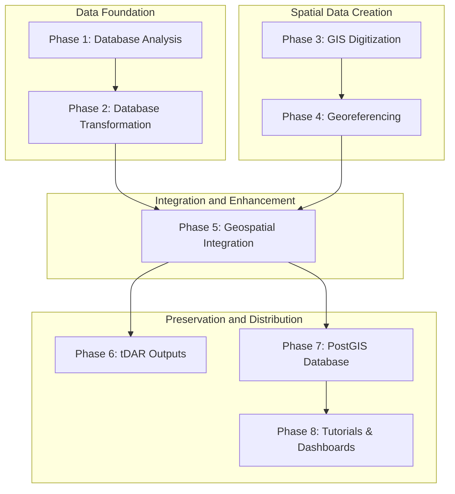

# Digital TMP - Project Overview (Draft v3.0 -- 6/24/2025)

---
**Author:** Rudolf Cesaretti
**Affiliation:** ASU Teotihuacan Research Laboratory
**Date:** June 24, 2025
**Version:** v3.0
---

## **Abstract**

The Teotihuacan Mapping Project (TMP) stands as one of the most ambitious archaeological survey and mapping efforts ever undertaken, providing an unparalleled dataset for the study of one of the ancient world's largest and most influential cities. Initiated in the 1960s, the project generated vast quantities of attribute data from surface collections and detailed geospatial information through comprehensive mapping. Over several decades, this data has transitioned from analog formats through multiple generations of digital databases and GIS files, managed primarily at Arizona State University’s Teotihuacan Research Laboratory. Despite numerous efforts to preserve, enhance, and integrate these datasets, significant challenges related to data fragmentation, quality, technological obsolescence, and incomplete documentation persist.

This document outlines the **Digital TMP Data Integration Initiative**, a comprehensive project aimed at definitively addressing these legacy issues. By systematically analyzing, transforming, integrating, and archiving the TMP's diverse digital assets, this initiative seeks to create a unified, reproducible, accurate, well-documented, and open-access geospatial research infrastructure. The project employs a phased, modular methodology, encompassing database analysis and transformation, GIS digitization and georeferencing, geospatial integration, and the creation of robust outputs for archival and dissemination through platforms like tDAR and a production-grade PostGIS database. The ultimate goal is to unlock the full scholarly potential of the TMP data for future generations of researchers, enabling new forms of data-driven inquiry into the urbanism, society, and history of Teotihuacan, while adhering to the highest principles of open science and reproducibility. The final output will be a modular, query-ready, and extensible digital infrastructure supporting both technical and non-technical audiences.

---

## **1. Introduction**

This document outlines the comprehensive vision, scope, and technical requirements for the **Digital TMP Data Integration Initiative**. The project's fundamental purpose is to modernize and unify the vast, complex, and invaluable legacy datasets of the Teotihuacan Mapping Project (TMP). For over half a century, the TMP archive has existed as a fragmented collection of analog and digital records, spanning decades of groundbreaking research and multiple generations of database technology. This initiative will transform these disparate assets into a singular, coherent, and powerful research tool: a unified, reproducible, accurate, well-documented, and open-access geospatial research infrastructure.

The project will systematically analyze, transform, integrate, and archive the TMP's diverse digital holdings to unlock their full scholarly potential. By resolving long-standing issues of data fragmentation, quality deficiencies, and technological obsolescence, we will enable new forms of data-driven inquiry into the urbanism, society, and history of Teotihuacan. This work is grounded in a firm commitment to the principles of open science and reproducibility, ensuring that every step of the data transformation process is transparent and verifiable. The final output will be a modular, query-ready, and extensible digital infrastructure designed to support a wide spectrum of users, from highly technical computational archaeologists to students and the general public, thereby securing the TMP's legacy for future generations of researchers and cultural heritage stewards.

---

## **2. Background and Rationale: A Complex Digital Legacy**

To understand the necessity and complexity of the current initiative, one must first appreciate the long and layered history of the Teotihuacan Mapping Project and its data. The challenges we address today are not the result of neglect, but rather the natural consequence of a pioneering, multi-generational research endeavor that has existed at the forefront of archaeological and computational methods for over sixty years.

### 2.1. The Teotihuacan Mapping Project: A Foundational Legacy of Urban Archaeology

Teotihuacan, flourishing in the Basin of Mexico from ca. 100 BCE to 650/750 CE, was an urban center of unparalleled scale and influence in the pre-Columbian Americas. Its comprehensive study was the ambitious goal of the Teotihuacan Mapping Project (TMP), initiated in 1962 by the visionary archaeologist René Millon. The TMP was a groundbreaking archaeological endeavor, involving an intensive, full-coverage survey of nearly 20 square kilometers, the meticulous mapping of thousands of architectural and topographical features, and the systematic collection of over one million artifacts from more than 5,000 distinct tracts. This monumental work culminated in the landmark 1973 publication, "Urbanization at Teotihuacan, Mexico, Volume 1: The Teotihuacan Map," a resource that remains foundational to Mesoamerican studies ([Millon 1973; Millon, Drewitt, and Cowgill 1973](C:\Users\rcesa\ASU Dropbox\Rudolf Cesaretti\GitHubRepos\TeoMappingProject\knowledge_base\Technical Report - Unfinished TMP Geospatial Data Across Three NSF Grants (1999-2020).md)).

The data generated by the TMP is inherently dual in nature, comprising two deeply interconnected components:
1.  **Rich Attribute Data:** This includes detailed observations transcribed from "Site Survey Record" (SSR) forms, extensive artifact counts, and complex typological classifications.
2.  **Fundamental Geospatial Data:** This consists of the iconic published maps, original field maps, and a series of 147 detailed "interpretation" sheets that form the cartographic bedrock of the project.

The true analytical power of the TMP data has always hinged on the precise and reliable linkage of these two components—a central challenge and recurring theme throughout the project's long history.

### 2.2. The Evolution of the TMP Digital Ecosystem: From Punch Cards to the PC Era

The transition from analog records to digital formats began remarkably early in the TMP's history, spearheaded by George Cowgill's visionary adoption of computational methods in 1965. This evolution spanned over five decades, resulting in a complex, multi-generational, and ultimately fragmented digital ecosystem.

#### 2.2.1. Early Computational Efforts (1960s-1970s): The DF1-DF8 Mainframe Era

The initial foray into digital data management was a Herculean effort involving the manual transcription of coded information from thousands of SSR forms onto punch cards for processing on mainframe computers like the IBM 7094. This era was characterized by a series of sequential and experimental data files (DFs), as detailed in the [TMP Database Genealogy Report (v2)](C:\Users\rcesa\ASU Dropbox\Rudolf Cesaretti\GitHubRepos\TeoMappingProject\knowledge_base\TMP_DB_Genealogy_v2.md).

*   **DF1-DF4:** These were preliminary, sequentially constructed, and often incomplete files used for methodological exploration and early statistical analyses. They were instrumental in pioneering the use of tools like SYMAP for generating spatial distribution maps, representing some of the earliest applications of computational geography in archaeology.
*   **DF5:** This file marked a technological shift, created by transferring data from approximately 50,000 punch cards onto magnetic tape, a more stable and efficient storage medium.
*   **DF6-DF7:** These iterations involved complex data editing and reformatting using custom-written FORTRAN programs. The monolithic nature of these programs, however, sometimes led to unintended data loss or corruption due to the complexity of a single-program approach, highlighting the fragility of early data management workflows.
*   **DF8:** Established between 1975 and 1977, DF8 became the core research database for many years, superseding all earlier files. It resided on VAX mainframes and introduced a more sophisticated "random access" file structure. However, DF8 also introduced a critical, and later highly problematic, feature: the "merging" of data from ~5,500 original collection lots into ~5,046 "cases" or "sites." This was done to create analytically meaningful units corresponding to architectural structures. Unfortunately, this merging process was, in the words of later researchers, "not always clearly documented" ([Technical Report - Unfinished Core Database Work...](C:\Users\rcesa\ASU Dropbox\Rudolf Cesaretti\GitHubRepos\TeoMappingProject\knowledge_base\Technical Report - Unfinished Core Database Work of the TMP Across Three NSF Grants (1999-2020).md)), creating a major obstacle for subsequent data integration and reconciliation efforts. Furthermore, the ceramic classifications within DF8 were eventually recognized as being too broad for the nuanced chronological and functional analyses that researchers desired.

#### 2.2.2. The Ceramic Reanalysis (REANS): A Parallel Data Stream

To address the analytical limitations of DF8's ceramic data, a comprehensive reanalysis, known as REANS, was initiated in the 1970s under the direction of Dr. Evelyn Rattray.

*   **Rationale:** The primary goal of REANS was to provide far more detailed typological and chronological information than was available in the generalized categories of DF8.
*   **Methodology:** Crucially, REANS was based on the original, individual collection lots, *not* the merged "sites" of DF8. This created a fundamental structural difference between the two main attribute datasets, a schism that has complicated integration efforts ever since. The data entry process was itself complex, involving manual transfer from paper forms to intermediate code sheets, and then to ASCII files.
*   **Challenges:** The REANS dataset came with its own set of integrity issues. The undocumented or ambiguously documented removal of certain sherds to be held as "specials" collections created count discrepancies that were difficult to resolve. It was not until the 1990s that Ian Robertson completed the first robust electronic versions of the REANS database.

#### 2.2.3. Relational Databases and GIS Integration (1990s): DF9 and MF2

The 1990s witnessed a paradigm shift to PC-based systems, bringing with it the power of relational databases and Geographic Information Systems (GIS).

*   **DF9:** Developed by Ian Robertson, DF9 represented a major leap forward. He migrated the data from the flat-file structure of DF8 into relational database systems, first Paradox and later Microsoft Access. This process involved not only a structural transformation but also the incorporation of numerous error corrections and, crucially, integration with digitized spatial data.
*   **MF2:** In parallel, Robertson created MF2, a digital map file of the TMP collection tract boundaries in both MapInfo and ArcView formats. The creation of MF2 was a watershed moment, as it enabled the first true GIS-supported spatial analyses by allowing researchers to link the polygonal tract boundaries directly to the rich attribute data in DF9.

#### 2.2.4. Ongoing Refinements and Emerging Challenges (2000s-Present): DF10 and Advanced GIS

Efforts to refine and manage the TMP data continued into the 21st century, with each new effort building on the last while also inheriting its unresolved problems.

*   **DF10:** Initiated by Anne Sherfield in 2022, DF10 is the most recent evolution of the main attribute database. Its goals were to reduce the complexity of the DF9 database, enhance user-friendliness (for example, by minimizing zero values using "long" table formats), and, critically, to begin systematically documenting the host of known, inherited data problems ([TMP Database Genealogy Report (v2)](C:\Users\rcesa\ASU Dropbox\Rudolf Cesaretti\GitHubRepos\TeoMappingProject\knowledge_base\TMP_DB_Genealogy_v2.md)).
*   **Geospatial Data Evolution:** The project's spatial data also underwent a parallel, and similarly complex, evolution.
    *   The 147 detailed "interpretation" sheets were scanned, and the process of georeferencing them as GeoTIFFs was initiated under a 1999 NSF grant. However, this crucial task was reported as still "underway" in 2002, and its final validation across all sheets remains a key uncompleted task ([Technical Report - Unfinished TMP Geospatial Data...](C:\Users\rcesa\ASU Dropbox\Rudolf Cesaretti\GitHubRepos\TeoMappingProject\knowledge_base\Technical Report - Unfinished TMP Geospatial Data Across Three NSF Grants (1999-2020).md)).
    *   Michael Smith later digitized the main TMP architectural map, creating another vital vector layer.
    *   Further GIS work was conducted by a series of researchers, including Huster, Dennehy, and notably Anne Sherfield, who undertook significant redigitization and methodological refinements to address inconsistencies and improve the spatial accuracy of the various GIS layers, as detailed in [Finalizing the GIS Digitization of the TMP Data Files v0](C:\Users\rcesa\ASU Dropbox\Rudolf Cesaretti\GitHubRepos\TeoMappingProject\knowledge_base\report_drafts\Finalizing the GIS Digitization of the TMP Data Files v0.md).

### 2.3. Previous NSF-Funded Interventions (1999-2020): Progress and Persistent Gaps

The significance of the TMP archive has been recognized by major funding bodies. Three significant NSF grants awarded to Arizona State University (ASU) between 1999 and 2020 were aimed at preserving, enhancing, and making accessible the TMP's digital legacy. These efforts laid crucial groundwork but also served to highlight the depth and persistence of the data challenges.

*   **NSF #SBR-9816263 (1999-2002):** This grant focused on data rescue, structural improvement, and initial web accessibility. Key outcomes included the creation of DF9 (MS Access) from DF8, an MS Access version of REANS, the reconciliation of most records between DF9, REANS, and MF2 (all but ~50 problematic cases), the reprojection of MF2 into standard coordinate systems, the scanning of the 147 interpretation sheets, and the development of an "integrated mapping" prototype. However, a number of key tasks remained unfinished: full error resolution in the databases, complete documentation for REANS, finalized EML metadata, completion of a planned ArcIMS website, and, critically, the full georeferencing of all 147 interpretation sheets ([Technical Report - Unfinished Core Database Work...](C:\Users\rcesa\ASU Dropbox\Rudolf Cesaretti\GitHubRepos\TeoMappingProject\knowledge_base\Technical Report - Unfinished Core Database Work of the TMP Across Three NSF Grants (1999-2020).md)).
*   **NSF #0004286 (2001-2002):** This was primarily an infrastructure grant that expanded and upgraded the ASU Teotihuacan Research Laboratory. It was vital for ensuring the physical preservation of the original analog maps, field notes, aerial photos, and artifact collections—the primary physical referents for all digital data ([Technical Report - Unfinished TMP Geospatial Data...](C:\Users\rcesa\ASU Dropbox\Rudolf Cesaretti\GitHubRepos\TeoMappingProject\knowledge_base\Technical Report - Unfinished TMP Geospatial Data Across Three NSF Grants (1999-2020).md)).
*   **NSF #1723322 (2017-2020):** This grant aimed to complete unfinished analyses, archive data in tDAR, and publish new findings. The project inherited DF10, which was still described as "far from optimal in organization and content." A critical new task (Task 2F) was explicitly defined: to "Clean the map GIS, link to the database," acknowledging that there were "problems that inhibit easy linkage" with Smith's digitized architectural map. While some progress was made (e.g., identifying outdated DF10 fields, readying some maps for tDAR), the final cleaning of DF10, the full integration of the most problematic REANS cases, and the complete "fixing" of the architectural map GIS to resolve linkage issues were all documented as "ongoing" or "uncompleted tasks" as of 2020 ([Technical Report - Unfinished Core Database Work...](C:\Users\rcesa\ASU Dropbox\Rudolf Cesaretti\GitHubRepos\TeoMappingProject\knowledge_base\Technical Report - Unfinished Core Database Work of the TMP Across Three NSF Grants (1999-2020).md); [Technical Report - Unfinished TMP Geospatial Data...](C:\Users\rcesa\ASU Dropbox\Rudolf Cesaretti\GitHubRepos\TeoMappingProject\knowledge_base\Technical Report - Unfinished TMP Geospatial Data Across Three NSF Grants (1999-2020).md)).

These decades of dedicated, painstaking effort by numerous researchers laid the essential groundwork for the current initiative. They successfully rescued the data from obsolescence multiple times. However, they also revealed the profound complexity of the task, setting the stage for a final, comprehensive integration initiative designed to address these persistent gaps once and for all.

### 2.4. The Core Problem: Data Fragmentation and Interoperability Failures

Despite its immense significance and the decades of work invested in it, the TMP dataset suffers from a complex array of legacy issues that severely hinder its full utilization by the modern research community. The core problem is the **fragmentation of the digital ecosystem** across multiple, non-interoperable datasets developed over more than 50 years, using different technologies, by different people, for different purposes. This initiative is necessary to resolve these long-standing issues, transforming the TMP's complex legacy into a powerful, accessible, and enduring resource.

The primary challenges that this project is designed to solve are:

*   **Heterogeneous Databases and Interoperability Failures:** The main attribute databases (DF8, DF9, DF10), the ceramic reanalysis database (REANS), and the various GIS vector files (MF2, architectural maps) were developed independently. This has led to inconsistent schemas, conflicting variable definitions, and unreliable linking keys, severely hindering robust cross-referencing and making system-wide querying nearly impossible. For instance, REANS uses original collection lots while DF8/DF9/DF10 use merged "sites," and resolving these differences for all cases remains a significant challenge ([Technical Report - Unfinished Core Database Work...](C:\Users\rcesa\ASU Dropbox\Rudolf Cesaretti\GitHubRepos\TeoMappingProject\knowledge_base\Technical Report - Unfinished Core Database Work of the TMP Across Three NSF Grants (1999-2020).md)).

*   **Data Quality and Integrity Deficiencies:** The data contains a multitude of known and latent issues.
    *   **Attribute Data Issues:** The main attribute database (DF10) was described in 2020 as "one of the biggest uncompleted tasks" and "far from optimal in organization and content," with only "slight progress" made on its cleaning during the 2017-2020 NSF grant. Issues include outdated or unreliable fields, typographical and coding errors, and inconsistencies in architectural categorizations ([Technical Report - Unfinished Core Database Work...](C:\Users\rcesa\ASU Dropbox\Rudolf Cesaretti\GitHubRepos\TeoMappingProject\knowledge_base\Technical Report - Unfinished Core Database Work of the TMP Across Three NSF Grants (1999-2020).md)). Furthermore, approximately 350 "particularly problematic collections" in the REANS ceramic database remain unresolved and unintegrated with DF10 due to complex historical data ambiguities. A pervasive issue known as the "Total Counts Problem," where the sum of artifact subdivisions in a collection exceeds the listed total, undermines quantitative analysis.
    *   **Geospatial Data Issues:** The digitized architectural map GIS was found to have "problems that inhibit easy linkage with the database," requiring a dedicated "fixing the map" effort (Task 2F of the 2017 grant) that was documented as ongoing as of 2020 ([Technical Report - Unfinished Core Database Work...](C:\Users\rcesa\ASU Dropbox\Rudolf Cesaretti\GitHubRepos\TeoMappingProject\knowledge_base\Technical Report - Unfinished Core Database Work of the TMP Across Three NSF Grants (1999-2020).md)). These problems could include geometric errors, attribute inconsistencies within GIS tables, or topological issues.

*   **Geospatial Data Complexities:** The spatial nature of the TMP data introduces specific challenges critical to its interpretation.
    *   **Georeferencing and Spatial Accuracy:** The project relies on a custom, non-standard, local coordinate system ("Millon Space"). The georeferencing of the 147 "interpretation" sheets, initiated under the 1999 NSF grant, was reported as "underway" in 2002. Their final, validated georeferencing status across all sheets, including accuracy assessments (e.g., RMSE), remains unconfirmed and is a critical uncompleted task ([Technical Report - Unfinished TMP Geospatial Data...](C:\Users\rcesa\ASU Dropbox\Rudolf Cesaretti\GitHubRepos\TeoMappingProject\knowledge_base\Technical Report - Unfinished TMP Geospatial Data Across Three NSF Grants (1999-2020).md)). Legacy map data often contains inherent local and systematic distortions that require sophisticated transformation methods (e.g., Thin Plate Spline or NTv2 grids, as explored in [Report_Georeferencing_TMP_Database.md](C:\Users\rcesa\ASU Dropbox\Rudolf Cesaretti\GitHubRepos\TeoMappingProject\knowledge_base\tmp_gis\georef\Report_Georeferencing_TMP_Database.md)) to ensure accurate alignment with modern coordinate systems.
    *   **Geometric and Topological Integrity:** GIS layers must be free of errors that compromise spatial calculations. The long history of the TMP means GIS datasets were often constructed at different times, by various personnel with differing goals and levels of precision. This can result in mismatched feature IDs, divergent schema definitions, varied spatial precision, and topological errors (e.g., unclosed polygons, slivers, overlaps, gaps) that must be systematically identified and corrected.

*   **Metadata Deficiencies and Documentation Gaps:** Comprehensive documentation is essential for data interpretability and long-term usability.
    *   Much of the TMP data lacks complete, standardized, machine-readable metadata. The 1999 NSF grant initiated extensive documentation for DF9 and planned EML metadata, but this was not fully finalized for all datasets ([Technical Report - Unfinished Core Database Work...](C:\Users\rcesa\ASU Dropbox\Rudolf Cesaretti\GitHubRepos\TeoMappingProject\knowledge_base\Technical Report - Unfinished Core Database Work of the TMP Across Three NSF Grants (1999-2020).md)).
    *   Its effective use has often relied on institutional memory and "insider knowledge," which is at high risk of being lost as original researchers age or depart.
    *   "Gray variables"—ambiguous fields with unclear definitions or truncated labels due to early computing storage limitations—require painstaking reconstruction from legacy codebooks or original paper records.

*   **Technological Obsolescence:** The data is currently stored in archaic or proprietary formats (e.g., MS Access, early MapInfo and ArcView shapefiles) that are incompatible with modern, open-source, and scalable data infrastructure like PostgreSQL/PostGIS. Early analyses used FORTRAN on VAX mainframes. This creates a high barrier to entry for researchers and makes the data vulnerable to future technological shifts.

*   **Preservation and Accessibility Gaps:** A complete, fully integrated version of the TMP dataset has never been published or archived in a discoverable, interoperable, and reusable (FAIR) format. This has prevented the broader research community from accessing this invaluable resource, limiting its potential impact and hindering the reproducibility of past and future studies. The physical archive (original maps, notebooks, negatives) also faces preservation risks without comprehensive digital backups.

This initiative is motivated by the scholarly imperative to address these long-standing issues head-on, thereby preserving and securing this irreplaceable global heritage resource and finally realizing its full potential by enabling new research, as envisioned in the project's multi-phase [architecture](C:\Users\rcesa\ASU Dropbox\Rudolf Cesaretti\GitHubRepos\TeoMappingProject\docs\architecture.md).

---

## **3. Project Vision, Goals, and Objectives**

The overarching vision of the Digital TMP Data Integration Initiative is to transform the project's vast and complex legacy data into a unified, accurate, thoroughly documented, and readily accessible digital research infrastructure. This initiative aims to empower new generations of researchers to explore Teotihuacan with unprecedented depth and analytical power, ensuring the long-term preservation and scholarly impact of this unique archaeological dataset.

### 3.1. Scholarly and Project Aims

The project's goals are centered on maximizing scholarly impact, ensuring long-term preservation, and enabling future research within both academic and heritage management contexts.

*   **Preserve and Secure a Global Heritage Resource:** To safeguard the unique and irreplaceable TMP dataset from physical degradation, technological obsolescence, and the loss of institutional knowledge, ensuring its integrity for posterity.
*   **Enhance Digital Scholarship and Research:** To produce curated, analysis-ready datasets and fully reproducible workflows that support advanced quantitative methods, sophisticated spatial modeling, and interdisciplinary investigations, thereby enabling entirely new research avenues into the study of Teotihuacan.
*   **Establish an Extensible Research Infrastructure:** To create a scalable, modular platform capable of seamlessly integrating future datasets—including data from the 28 TMP test excavations, modern drone photogrammetry, LiDAR, Ground-Penetrating Radar (GPR), and INAH archival data—ensuring the platform's long-term viability and relevance.
*   **Foster Open Science and Reproducibility:** To rigorously adhere to open science principles by employing transparent methodologies, well-documented workflows, version-controlled scripts, and comprehensive documentation to ensure the complete reproducibility of all data transformations and analytical outputs.
*   **Enhance Accessibility and Dissemination:** To provide multiple, diverse pathways for data access—including easily downloadable datasets, a production-grade PostGIS database, and interactive web applications—to serve a broad array of stakeholders with varying technical skills.
*   **Support Educational Use:** To develop curriculum-aligned modules, tutorials, and sample datasets that enable the use of TMP data in educational settings for archaeology, digital humanities, data science, and GIS courses.

### 3.2. Core Technical Objectives

To achieve this vision, the project will pursue a series of interconnected technical objectives, forming the backbone of the entire initiative and drawing upon the systematic methodologies outlined in the [project architecture document](C:\Users\rcesa\ASU Dropbox\Rudolf Cesaretti\GitHubRepos\TeoMappingProject\docs\architecture.md).

*   **Attribute Database Finalization and Integration:**
    *   **Complete DF10 Cleaning and Validation:** Execute a systematic, field-by-field and record-by-record audit of the main TMP attribute database (DF10) to identify and correct all remaining errors (typographical, coding, computational), purge outdated or unreliable data fields, and standardize categorical variables. This directly addresses what was previously described as "one of the biggest uncompleted tasks" ([Technical Report - Unfinished Core Database Work...](C:\Users\rcesa\ASU Dropbox\Rudolf Cesaretti\GitHubRepos\TeoMappingProject\knowledge_base\Technical Report - Unfinished Core Database Work of the TMP Across Three NSF Grants (1999-2020).md)).
    *   **Finalize REANS Data Integration:** Achieve full resolution of the data ambiguities within the approximately 350 "particularly problematic collections" in the REANS ceramic database and complete their verified, seamless integration into the finalized database structure.
    *   **Structural Optimization:** Engineer the final database schema (to be named `TMP_DF12` as per [architecture.md](C:\Users\rcesa\ASU Dropbox\Rudolf Cesaretti\GitHubRepos\TeoMappingProject\docs\architecture.md) Workflow 2.2) for optimal relational integrity and query performance, employing denormalization strategies where justified for analytical efficiency.

*   **Geospatial Data Remediation, Validation, and Standardization:**
    *   **Complete and Validate Georeferencing:** Ensure all core TMP map products—including the primary architectural map, the MF2 collection tract map, and, crucially, all 147 "interpretation" sheets—are georeferenced to a high, documented standard of absolute and relative spatial accuracy (<2m RMSE) using robust methodologies (as explored in [tmp_gis/georef/Report_Georeferencing_TMP_Database.md](C:\Users\rcesa\ASU Dropbox\Rudolf Cesaretti\GitHubRepos\TeoMappingProject\knowledge_base\tmp_gis\georef\Report_Georeferencing_TMP_Database.md)).
    *   **Comprehensive Spatial Cleaning:** Perform rigorous spatial cleaning of all GIS vector layers. This includes correcting geometric errors, ensuring topological integrity (resolving all overlaps, gaps, and dangles), and standardizing feature representations to address the "fixing the map" task left ongoing in 2020 ([Technical Report - Unfinished Core Database Work...](C:\Users\rcesa\ASU Dropbox\Rudolf Cesaretti\GitHubRepos\TeoMappingProject\knowledge_base\Technical Report - Unfinished Core Database Work of the TMP Across Three NSF Grants (1999-2020).md)).
    *   **Standardize Coordinate Systems:** Ensure all geospatial datasets adhere to consistent, well-documented coordinate reference systems (UTM Zone 14N) and levels of spatial precision.

*   **Robust Data Integration and Interoperability:**
    *   **Achieve Verified Linkage:** Establish and meticulously verify a seamless, accurate, and bidirectional linkage between the finalized attribute databases and all cleaned geospatial layers. This is critical for resolving the "problems that inhibit easy linkage" identified in previous grant reports ([Technical Report - Unfinished Core Database Work...](C:\Users\rcesa\ASU Dropbox\Rudolf Cesaretti\GitHubRepos\TeoMappingProject\knowledge_base\Technical Report - Unfinished Core Database Work of the TMP Across Three NSF Grants (1999-2020).md)).
    *   **Implement Consistent Identifiers:** Ensure that unique, consistent, and reliable linking keys (e.g., structure IDs, tract IDs) are employed across all database tables and GIS attribute tables to guarantee absolute relational integrity.

*   **Comprehensive Metadata Development:**
    *   **Create Standardized Metadata:** Develop comprehensive, standardized, machine-readable metadata for every data component (tables, layers, source documents). This metadata will cover provenance, methodology, data structure, variable definitions, coding schemes, georeferencing parameters, and spatial accuracy assessments.
    *   **Ensure Archival Compliance:** Adhere to the FAIR (Findable, Accessible, Interoperable, Reusable) data principles and the specific requirements of archival repositories like tDAR.

*   **Advanced Data Transformation and Enhancement (as per `architecture.md`):**
    *   **Systematic ETL Processes**: Implement robust Extract, Transform, Load (ETL) pipelines for data cleaning, schema harmonization, and structural reorganization from legacy formats to analysis-ready datasets (Phases 1-2, [architecture.md](C:\Users\rcesa\ASU Dropbox\Rudolf Cesaretti\GitHubRepos\TeoMappingProject\docs\architecture.md)).
    *   **Database Profiling and Schema Optimization**: Conduct thorough analysis of database structures, optimize schemas, and standardize controlled vocabularies to enhance data quality and analytical coherence.
    *   **Feature Engineering**: Derive new analytical variables through consolidation, decomposition, or computation from existing data fields to support advanced research questions (Phase 5, [architecture.md](C:\Users\rcesa\ASU Dropbox\Rudolf Cesaretti\GitHubRepos\TeoMappingProject\docs\architecture.md)).

### 3.3. User Goals and Use Cases

The project is designed to empower various user groups to achieve their specific objectives more effectively and efficiently than ever before.

*   **Mesoamerican Archaeologists:** To analyze ceramic distributions, architectural patterns, and surface collection data with unprecedented precision. For scholars revisiting previously studied areas—such as Plaza One, Oztoyahualco, or the Oaxaca Barrio—the unified platform provides the spatial and typological infrastructure needed to recontextualize earlier interpretations with updated, fully integrated, and spatially accurate datasets. They will be able to re-evaluate long-standing hypotheses with a new level of confidence.
*   **Comparative Urbanism Scholars:** To incorporate Teotihuacan as a robust, data-rich case study in global comparisons of early cities. With a spatially normalized and cleaned dataset, Teotihuacan can now be rigorously compared to other early cities across the world—including sites in the Indus Valley, ancient China, and the Andes. The cleaned and standardized data will be suitable for settlement scaling theory, urban density modeling, and infrastructural complexity analyses.
*   **Computational Archaeologists and Data Scientists:** To apply machine learning, network analysis, and advanced quantitative methods to a large, structured, and clean archaeological dataset. With the full integration of artifact counts, typologies, and spatial geometries, classification algorithms can be applied to cluster ceramic assemblages by spatial context, or to detect pattern anomalies in the spatial layout of craft production zones. The project's transparent, scripted methodology also serves as a replicable template for other legacy data rescue initiatives.
*   **University Educators and Students:** To use real-world, research-grade datasets in classrooms for hands-on spatial analysis projects. The unified dataset will be packaged with curriculum-aligned modules that can be deployed in archaeology, digital humanities, and GIS classrooms. Students will learn data integration, cleaning, and analysis techniques using open-source tools like QGIS, Python, and R, guided by project-provided tutorials.
*   **Cultural Heritage Managers (e.g., INAH):** To use a precision geospatial record of the ancient city for regulatory, conservation, and site protection planning. The dataset can serve as a foundational layer for defining site protection zones, evaluating threats from modern development, and designing sustainable tourism and urban policies in the Teotihuacan Valley.
*   **The General Public:** To explore the complexity and richness of the ancient city of Teotihuacan through accessible, interactive web maps and visualizations. By publishing outputs in formats compatible with web-based platforms, the project will make Teotihuacan accessible to a global audience, stimulating cultural curiosity, promoting public education, and supporting site stewardship.

---

## **4. Stakeholders**

The Digital TMP Data Integration Initiative is designed to serve a broad constituency, from the core research team to the global public. Understanding these stakeholders and their needs is fundamental to the project's design and dissemination strategy.

### 4.1. Formal Project Stakeholders

*   **ASU Teotihuacan Research Laboratory:** As the primary institutional stakeholder and project host, the lab is the custodian of the original TMP datasets and the center of ongoing Teotihuacan research. The lab directly benefits from the integration and modernization of these critical resources, which will support its future research, grant applications, and fieldwork planning, while cementing the digital legacy of its decades of scholarly contributions.
*   **Digital Antiquity and tDAR:** Digital Antiquity, through The Digital Archaeological Record (tDAR), serves as the formal archival partner for long-term data preservation and dissemination. As a leading archaeological data repository, tDAR provides the essential infrastructure and standards to ensure the project's outputs are professionally archived, receive persistent identifiers (DOIs), and remain accessible to the global research community in perpetuity. This partnership exemplifies best practices in archaeological data stewardship and digital preservation.

### 4.2. Academic Stakeholders

*   **Mesoamerican Archaeologists:** This group represents the primary scholarly audience. The integrated platform will allow them to investigate questions previously impossible to address, such as re-examining artifact distributions in areas like Plaza One, Oztoyahualco, or the Oaxaca Barrio with full spatial and typological confidence.
*   **Comparative Urbanism Scholars:** This initiative provides this field with one of the most comprehensive datasets on an early city available anywhere. With spatially normalized and cleaned data, Teotihuacan can be rigorously compared to other ancient urban centers in the Indus Valley, China, or the Andes, fueling research into universal patterns of urban development.
*   **Computational Archaeologists and Data Scientists:** This project serves as both a rich dataset and a methodological case study. The structured, cleaned data is ideal for applying machine learning algorithms to cluster ceramic assemblages or detect spatial anomalies in craft production. The transparent, scripted workflow also provides a valuable template for other legacy data rescue projects, demonstrating how to manage modular ETL pipelines, CRS transformations, and semantic metadata layering.
*   **Universities and Teaching Institutions:** The project will produce curriculum-aligned modules for use in archaeology, digital humanities, and GIS classrooms. Students will gain valuable skills by working with a real-world, complex dataset, using open-source tools like QGIS and Jupyter Notebooks to replicate professional research workflows.

### 4.3. Governmental and Policy Organizations (Informal Stakeholders)

While not formal partners, these organizations are key potential beneficiaries of the project's outputs.

*   **INAH (Instituto Nacional de Antropología e Historia):** As Mexico's principal cultural heritage authority, INAH can leverage the high-precision geospatial record of the ancient city for critical regulatory, conservation, and planning purposes. The dataset can serve as a foundational layer for defining site protection zones, evaluating the impact of modern construction, and designing sustainable tourism and urban policies in the Teotihuacan Valley.
*   **INEGI and Regional Planning Authorities:** The Mexican National Institute of Statistics and Geography (INEGI) and other regional planning bodies can use the project's spatial data to better navigate the city's archaeological footprint. The ability to overlay proposed infrastructure projects, land parcels, and zoning maps onto a high-resolution model of Teotihuacan's urban core can facilitate more ethically responsible and sustainable development.

### 4.4. Public and Global Impact

*   **The General Public:** By publishing outputs in formats compatible with web platforms (e.g., Leaflet, GeoJSON), the project will make the ancient city accessible to a global audience. Interactive maps and "story maps" can convey the complexity and richness of Teotihuacan in engaging ways, stimulating public curiosity and fostering a sense of shared stewardship.
*   **Global Research Community:** The initiative aligns with the goals of major international data repositories by emphasizing the FAIR data principles (Findable, Accessible, Interoperable, Reusable). It not only joins but also elevates the global infrastructure for archaeological research, enabling new forms of interdisciplinary collaboration. The open data model invites future collaborative layers, from LiDAR visualizations to historical document overlays, transforming how ancient urban sites are studied, preserved, and shared.

---

## **5. Scope of Work**

To maintain focus and ensure the successful completion of the core objectives, the project's scope is clearly defined. This section outlines what is included within the project's lifecycle and what is explicitly excluded.

### 5.1. In Scope

The project is a comprehensive data modernization initiative executed through eight distinct, sequential phases. The scope includes all activities, transformations, and deliverables defined within these phases.

*   **Phase 1: Database Analysis:**
    *   Systematic evaluation and quantitative profiling of four legacy MS Access databases (TMP\_DF8, DF9, DF10, REAN\_DF2).
    *   Migration of these legacy databases into a reproducible PostgreSQL infrastructure.
    *   Generation of denormalized "benchmark" databases to quantitatively assess performance trade-offs.
    *   Automated generation of Entity-Relationship Diagrams (ERDs) for visual schema documentation.
*   **Phase 2: Database Transformation:**
    *   Comprehensive ETL (Extract, Transform, Load) and feature engineering to produce the final, analysis-ready tabular datasets (`TMP_DF12`, `TMP_REANs_DF4`).
    *   Implementation of automated data quality validation frameworks (e.g., Great Expectations) to ensure data integrity.
*   **Phase 3: GIS Digitization:**
    *   Manual, high-fidelity digitization of all archaeological, environmental, and modern features from the historical TMP raster maps (Topo/Survey Map and Architectural Reconstructions Map).
    *   Application of provisional attribute schemas and rigorous validation of topologies.
*   **Phase 4: Georeferencing:**
    *   High-precision georeferencing of all raster and vector datasets, transforming them from the local "Millon Space" to the standard UTM Zone 14N coordinate system.
    *   Development and application of custom NTv2 grid shift transformations for maximum accuracy.
    *   Rigorous spatial accuracy assessment and validation of all outputs.
*   **Phase 5: Geospatial Integration:**
    *   Full integration of the transformed tabular datasets with the georeferenced spatial vector layers within the PostGIS environment.
    *   Advanced geospatial feature engineering to derive new, analytically valuable spatial attributes (e.g., density, proximity, area).
*   **Phase 6: tDAR Outputs:**
    *   Preparation and packaging of all final datasets for long-term archival and preservation in tDAR (The Digital Archaeological Record).
    *   Creation of comprehensive, multi-level metadata compliant with tDAR and FAIR standards.
*   **Phase 7: PostGIS Database:**
    *   Design and deployment of a production-grade spatial database using PostgreSQL and PostGIS, optimized for analytical performance.
    *   Packaging and distribution of the complete database via Docker containers and standard SQL dumps.
*   **Phase 8: Tutorials & Dashboards:**
    *   Development of a public-facing, interactive WebGIS dashboard using Leaflet.js for data exploration.
    *   Creation of a RESTful API using FastAPI to serve curated datasets programmatically.
    *   Development of comprehensive tutorials for Python, R, and QGIS workflows.

### 5.2. Out of Scope

To maintain a clear focus and ensure the successful completion of the core objectives within the project's lifecycle, the following items are explicitly defined as being out of scope.

*   **Data-Centric Exclusions:**
    *   **Full Integration of Excavation Records:** The project will focus exclusively on the integration of the TMP *surface collection* databases. The full, detailed integration of the rich and complex data from the 28 TMP test excavations is a separate, major undertaking that will be enabled by this project but is not part of it.
    *   **Integration of Specialized Ancillary Datasets:** The project will not integrate other specialized datasets that require different analytical methodologies, such as faunal analysis records, human osteological data, or detailed lapidary studies, beyond the information already present in the core DF and REANS databases.

*   **Feature-Centric Exclusions:**
    *   **Public Data Contribution Portal:** The project will deliver a one-way data dissemination platform. It will not build features to allow external users to upload their own data, annotate existing records, or provide feedback through the platform itself.
    *   **Advanced 3D Modeling and Visualization:** The project's visualization outputs are limited to 2D and 2.5D geospatial representations. The creation of high-fidelity 3D architectural models or immersive Virtual Reality (VR) / Augmented Reality (AR) experiences is out of scope.

*   **Analytical Exclusions:**
    *   **Publication of New Scholarly Interpretations:** The primary goal of this project is to create a research *infrastructure*. The project's deliverables are data products, tools, and documentation, not peer-reviewed articles presenting new conclusions about Teotihuacan. The project enables new research; it does not conduct it.

---

## **6. Project Architecture and Methodology**

The methodological strategy for the Digital TMP initiative is a modular, multi-phase pipeline designed to systematically convert a complex legacy archive into a unified, query-ready, and extensible digital infrastructure. The architecture is rooted in principles of open science, reproducibility, and modern data engineering, progressing through eight methodologically distinct phases.

### 6.1. Guiding Principles

The architecture incorporates modern data science principles throughout, ensuring the final product is robust, reliable, and sustainable.

*   **Reproducibility:** All data transformations are documented in version-controlled scripts (Python, R, SQL) and executed within containerized environments (Docker) to ensure that every step of the process can be exactly replicated. All transformation code is housed in Git repositories with comprehensive version control.
*   **Interoperability:** All outputs conform to open, community-accepted standards (e.g., GeoJSON, Shapefile, CSV, GeoTIFF, SQL) to ensure broad compatibility with existing and future software.
*   **Extensibility:** The final architecture is modular, allowing for the future integration of new datasets (e.g., TMP excavations, LiDAR, GPR) without requiring a complete overhaul of the system. The resulting infrastructure can accommodate future technological evolution while maintaining backward compatibility and data integrity.
*   **Scalability:** The system is designed using PostgreSQL/PostGIS to handle the full complexity of the TMP dataset while maintaining high performance for analytical queries and data distribution.
*   **Accessibility:** The project provides multiple distribution mechanisms to serve diverse user communities, balancing the need for long-term preservation with contemporary access patterns.
*   **Provenance Tracking:** The system is designed to maintain a complete and traceable lineage for all data, from the original raw records to the final integrated outputs, ensuring that users can understand the history of any given data point.

### 6.2. Modular Workflow Architecture

The project adopts a three-tiered logic of execution to manage its complexity:
*   **Phases:** The highest level of organization, representing eight major stages of data transformation that systematically transform legacy archaeological databases into a modern, integrated geospatial data infrastructure.
*   **Workflows:** The sequence of operations within each phase (e.g., schema profiling, ETL, topology validation), representing modular processes.
*   **Tasks:** The smallest, atomic units of execution, often corresponding to a single script or a specific manual review step, tracked for reproducibility.

This tiered structure facilitates collaborative work, allows for asynchronous contributions, and enables fine-grained documentation of every decision and tool used at each stage of the pipeline.

### 6.3. Phase Overview Summary

| Phase | Description | Inputs | Key Outputs |
|-------|-------------|--------|-------------|
| **Phase 1: Database Analysis** | Systematic evaluation and profiling of legacy TMP databases to inform optimal schema design and transformation strategies. | 4 MS Access DBs, historical documentation | Reproducible PostgreSQL migration, ERDs, schema profiling reports, denormalization white paper. |
| **Phase 2: Database Transformation** | Comprehensive ETL and feature engineering to produce analysis-ready tabular datasets with standardized vocabularies. | PostgreSQL tables, controlled vocabularies | `TMP_DF12`, `TMP_REANs_DF4`, transformation logs, data quality validation reports. |
| **Phase 3: GIS Digitization** | Manual digitization of all archaeological, environmental, and modern features from historical raster maps. | Scanned raster basemaps, legacy documentation | Complete set of digitized vector layers, provisional attribute schemas, digitization metadata. |
| **Phase 4: Georeferencing** | High-precision georeferencing of all data from "Millon Space" to UTM 14N using custom NTv2 transformations. | Digitized vectors, GCPs, raster tiles | Spatially-aligned datasets, custom NTv2 transformation grids, spatial accuracy assessments. |
| **Phase 5: Geospatial Integration** | Full integration of tabular and spatial data with advanced feature engineering and final architectural classification. | Cleaned GIS layers, `TMP_DF12`, `REANs_DF4` | Fully integrated geospatial database, derived spatial attributes, final classification schemes. |
| **Phase 6: tDAR Outputs** | Preparation and packaging of archival-ready datasets with comprehensive metadata for long-term preservation. | All integrated datasets, metadata schemas | tDAR-compliant archival packages, data dictionaries, user documentation, tutorials. |
| **Phase 7: PostGIS Database** | Design and deployment of a production-grade spatial database with optimized schemas and performance tuning. | All integrated geospatial datasets | Production PostGIS database, ready-to-deploy Docker containers, full and schema-only SQL dumps. |
| **Phase 8: Tutorials & Dashboards** | Development of user-facing applications and comprehensive tutorials for diverse analytical workflows. | Production PostGIS database, static exports | Interactive WebGIS dashboard, public RESTful API, comprehensive Python/R/QGIS tutorials. |

### 6.4. Architecture Flow Diagram

This diagram illustrates the project's logical flow. The attribute data (Phases 1-2) and spatial data (Phases 3-4) are processed and validated independently before being brought together in the crucial Geospatial Integration phase (Phase 5). From this unified core, the project branches into its final output streams for long-term preservation (Phase 6) and active dissemination (Phases 7-8).

### 6.5. Detailed Phase Descriptions

*   **Phase 1 – Legacy Database Analysis & Architectural Recommendation:** This initial phase involves a rigorous, quantitative evaluation of all four legacy TMP databases (TMP_DF8, TMP_DF9, TMP_DF10, and TMP_REAN_DF2). The workflow establishes a reproducible pipeline to profile the structure, content, and relational complexity of each legacy schema. Crucially, it creates denormalized, wide-format benchmark databases to quantitatively measure the performance trade-offs of different architectural models. Through automated database profiling, structural visualization, and quantitative schema analysis, this phase produces reproducible PostgreSQL versions of all legacy databases, automated Entity-Relationship Diagrams (ERDs), and a comprehensive denormalization white paper with schema optimization recommendations. The key deliverable is a technical white paper that uses this evidence to formally recommend a unified target schema, justified by direct performance benchmarks and data modeling best practices.

*   **Phase 2 – Legacy Database Transformation & Unification:** Building on the recommendations from Phase 1, this phase implements the full-scale ETL pipeline. It consolidates complementary information from three versions of the legacy database (DF8, DF9, DF10) to produce a provisional consolidated dataset (DF11), cleans and validates the REANs database to produce REANs DF3, and then undertakes intensive, variable-by-variable redesign to produce the final `TMP_DF12` and `TMP_REANs_DF4` datasets. The phase implements controlled vocabulary standardization and automated validation frameworks (e.g., Great Expectations) to ensure data quality and analytical coherence. This involves developing robust data mapping and validation rules to ensure referential integrity, resolve data type inconsistencies, and consolidate redundant or conflicting information.

*   **Phase 3 – GIS Digitization:** This phase addresses the manual digitization of all features from the historical maps. Operating within a pre-georeferenced context, this is a labor-intensive process using QGIS, guided by a composite of scanned maps, aerial imagery, and legacy documentation. Features include archaeological (floors, walls, plazas), environmental (canals, barrancas), and modern (roads, buildings) elements. This phase overcomes the limitations of legacy cartographic materials through custom transformation pipelines.

*   **Phase 4 – Georeferencing:** This phase implements the high-precision workflows to spatially align all data. It involves establishing ground control points (GCPs), developing and applying the custom NTv2 grid shift transformations, and rigorously assessing the final spatial accuracy of all layers to meet the sub-2-meter RMSE target. The process includes sensitivity analysis to evaluate transformation performance, recursive georeferencing error assessment, and the generation of custom CRS transformation pipelines using PROJ with NTv2 grid shift capabilities.

*   **Phase 5 – Geospatial Integration:** This is the convergence point. It merges the cleaned tabular datasets (`TMP_DF12`, `TMP_REANs_DF4`) with their corresponding georeferenced spatial geometries. It then leverages the power of PostGIS to perform advanced feature engineering, deriving new analytical variables based on spatial relationships (e.g., proximity to features, density within zones) and finalizing the classification of architectural features through spatial cross-referencing. All integrated outputs are validated through automated quality assurance protocols.

*   **Phase 6 – tDAR Outputs:** This phase focuses on preparing all final data products for long-term archival and dissemination. It involves exporting data to archival-safe formats (Shapefile, CSV, GeoTIFF), creating comprehensive, multi-level metadata, writing detailed documentation and data dictionaries, and packaging everything into tDAR-compliant submission bundles that meet strict archival standards.

*   **Phase 7 – PostGIS Database:** This phase involves the design and deployment of the production-grade PostGIS database that will serve as the project's analytical backend. This includes schema optimization, performance tuning (e.g., spatial indexing, materialized views), and packaging the entire database for distribution via Docker and SQL dumps, enabling complex spatial queries and efficient data dissemination.

*   **Phase 8 – Tutorials & Dashboards:** The final phase focuses on building the user-facing access points. This includes developing the interactive WebGIS dashboard with Leaflet.js, creating the public RESTful API with FastAPI, and writing the comprehensive suite of tutorials in Jupyter (Python), RMarkdown (R), and for QGIS to facilitate effective use and exploration of the database.

---

## **7. Tools, Technologies, and Software Stack**

The project leverages a comprehensive, open-source-first technology stack tailored for reproducible geospatial data science. The software selection prioritizes stability, scalability, interoperability, and long-term maintainability, ensuring compatibility with both research and archival infrastructure requirements.

### 7.1. Project Environment: `digital_tmp_base`

All work is conducted within a dedicated Conda environment named `digital_tmp_base` to ensure complete reproducibility and consistent dependency management. This environment, defined in the project's `environment.yml` file, includes all necessary Python packages, geospatial libraries, and analytical tools required for the eight-phase workflow. It can be recreated on any workstation using the `conda env create -f environment.yml` command, ensuring a consistent foundation for all contributors and maintaining the integrity of analytical outputs across different computing environments.

### 7.2. Software Used by Phase

| Phase | Core Technologies | Specialized Tools & Libraries |
|-------|-------------------|-------------------------------|
| **Phase 1: Database Analysis** | **PostgreSQL 17, Python 3.11+** | SQLAlchemy, psycopg2, Pandas, Graphviz (for ERDs), Plotly (for visualization), Jupyter Notebooks |
| **Phase 2: Database Transformation** | **PostgreSQL 17, Python 3.11+** | Pandas, GeoPandas, SQLAlchemy, Great Expectations (for validation), dbt (optional), Jupyter Notebooks, regex |
| **Phase 3: GIS Digitization** | **QGIS 3.40.5** | QGIS Topology Checker, Geometry Validation tools, Python (GeoPandas, Shapely) for QA |
| **Phase 4: Georeferencing** | **QGIS 3.40.5, GDAL 3.6+ (tested on 3.6.2†), PROJ 9.0+** | QGIS Georeferencer, `gdal_warp`, `gdal_translate`, pyproj, custom NTv2 grid tools, R/Python spatial stats libraries |
| **Phase 5: Geospatial Integration** | **PostgreSQL 17 + PostGIS 3.4, Python 3.11+** | GeoPandas, Shapely, psycopg2, rasterstats, QGIS (for visualization), advanced SQL spatial functions |
| **Phase 6: tDAR Outputs** | **PostgreSQL + PostGIS, GDAL, Python/R** | `ogr2ogr`, GeoPandas, `sf` (R), `tidyverse` (R), Pandoc, LaTeX/Markdown, 7-Zip |
| **Phase 7: PostGIS Database** | **PostgreSQL 17 + PostGIS 3.4, Docker** | `ogr2ogr`, `raster2pgsql`, psycopg2, SQLAlchemy, FastAPI, Docker Compose, `pg_dump` utilities |
| **Phase 8: Tutorials & Dashboards** | **FastAPI, Leaflet.js, Python 3.11+, R 4.3+** | Folium, Plotly, `sf`, `ggplot2`, `tmap`, `DBI`, `RPostgreSQL`, Jupyter Notebooks, RMarkdown, QGIS |

† GDAL 3.8+ remains optional for the `gdal_footprint` utility and new JSONFG / PMTiles drivers but is **not required** for project workflows.

### 7.3. Core Technology Domains

*   **Database and Backend Infrastructure:** **PostgreSQL 17 with PostGIS 3.4** serves as the foundational database architecture. It provides enterprise-grade spatial capabilities, ACID compliance, and excellent performance for complex analytical queries, representing a massive leap forward from the legacy MS Access files.
*   **Geospatial Processing Environment:** **QGIS 3.40.5** is the primary tool for manual digitization and visualization, while the **GDAL/OGR 3.6+** and **PROJ 9.0+** libraries form the command-line backbone for all data format conversions and coordinate transformations.
*   **Programming and Analysis Frameworks:** The **Python 3.11+** ecosystem (Pandas, GeoPandas, SQLAlchemy) is used for the core data transformation and ETL pipelines. The **R 4.3+** environment (`sf`, `tidyverse`) is used for specialized statistical analysis and publication-quality graphics. **Jupyter Notebooks** and **RMarkdown** ensure all analyses are documented and reproducible.
*   **Deployment and Containerization:** **Docker** and **Docker Compose** are used to containerize the entire PostGIS database environment. This ensures that the final database can be deployed consistently and reliably on any system, eliminating "it works on my machine" problems and facilitating collaboration.
*   **Data Dissemination and Web Services:** **FastAPI** is used to build the lightweight, high-performance RESTful API, providing programmatic data access with automatic documentation. **Leaflet.js** is the chosen library for the interactive web map, as it is lightweight, open-source, and has no external dependencies.

---

## **8. System Requirements**

The system must provide the capabilities necessary to execute the entire data transformation and dissemination pipeline, meeting both functional and non-functional requirements.

### 8.1. Functional Requirements

*   **Database Analysis & Profiling (Phase 1):** The system must be able to ingest legacy SQL dumps, generate denormalized benchmark databases, and produce automated schema profiles and ERDs.
*   **Database Transformation & ETL (Phase 2):** The system must support a staged ETL pipeline, variable-level feature engineering, text normalization, enforcement of controlled vocabularies, and integration with an automated data quality validation framework like Great Expectations.
*   **GIS Digitization & Georeferencing (Phases 3-4):** The system must support manual, topology-constrained vector digitization in QGIS and high-precision georeferencing workflows, including the ability to generate and apply custom NTv2 grid shift files.
*   **Geospatial Integration & Analysis (Phase 5):** The system must perform SQL-based spatial joins to merge tabular and vector data and support advanced geospatial feature engineering (e.g., calculating area, density, proximity).
*   **Data Packaging & Dissemination (Phases 6-8):** The system must be able to export data into multiple standard formats (Shapefile, GeoJSON, CSV, GeoTIFF), generate archival-compliant metadata for tDAR, be deployable as a Dockerized PostGIS database, and power a RESTful API and interactive WebGIS dashboard.

### 8.2. Non-Functional Requirements

*   **Reproducibility:** All data transformations must be fully reproducible through version-controlled scripts and containerized environments.
*   **Provenance Tracking:** The system must maintain a complete and traceable lineage for all data from original records to final outputs.
*   **Quality Assurance:** The system must implement multi-stage validation, including automated frameworks (Great Expectations) and expert human review.
*   **Scalability:** The architecture must handle the full TMP dataset and be designed to accommodate future expansion with new datasets (e.g., LiDAR, excavation data).
*   **Interoperability:** All outputs must conform to open, community-accepted standards (GeoJSON, Shapefile, CSV, etc.) to ensure maximum compatibility.
*   **Accessibility:** The system must provide multiple, well-documented methods for data access, including direct database access, downloadable files, an API, and web applications.
*   **Performance:** The PostGIS database must be optimized for analytical query performance through spatial indexing, materialized views, and a denormalized schema where appropriate. Web services must be responsive.
*   **Security:** The system must protect data integrity and development environment security. This includes managing secrets via environment variables, sandboxing AI agent filesystem access, using safe database connection modes, and following tDAR's protocols for handling confidential data.
*   **Usability:** User-facing components (tutorials, dashboard) must be intuitive, well-documented, and cater to users with varying levels of technical expertise.
*   **Reliability:** Production services (API, dashboard) must be stable and consistently available, facilitated by containerization and automated deployment scripts.

---

## **9. Project Deliverables and Key Outputs**

This project will produce a comprehensive suite of integrated data products, software, and documentation designed for long-term use, preservation, and dissemination. The outputs are structured to serve multiple user communities simultaneously, representing the culmination of the eight-phase transformation pipeline.

### 9.1. Database Products

*   **Final Analytical Datasets:** The fully cleaned, validated, and documented `TMP_DF12` (main attributes) and `TMP_REANs_DF4` (ceramic reanalysis) datasets, delivered as CSV files. These serve as the core tabular outputs of the entire project.
*   **Controlled Vocabulary Glossaries:** Comprehensive lookup tables and human-readable PDFs documenting all categorical variables and their standardized terminology.
*   **Variable Transformation Logs:** Detailed documentation of all modifications, engineering steps, and data quality decisions made during the transformation process.
*   **PostGIS Database:** A production-grade PostgreSQL/PostGIS database containing the fully integrated spatial and attribute data. This will be distributed in multiple forms:
    *   A ready-to-deploy **Docker image** for easy, reproducible deployment.
    *   **Full and schema-only SQL dumps** for advanced users who wish to set up the database on their own infrastructure.

### 9.2. Geospatial Data Products

*   **Georeferenced Vector Layers:** A complete set of validated vector layers (in both Shapefile and GeoJSON formats) for all digitized features, including collection units, architectural features (floors, walls, plazas, etc.), environmental data, and modern features, accurately georeferenced to UTM Zone 14N.
*   **Georeferenced Raster Layers:** High-resolution GeoTIFFs of the original TMP Topographic and Architectural Interpretation maps, correctly georeferenced.
*   **Transformation Grid File:** The custom NTv2 grid shift file (`.gsb`) used to transform data from "Millon Space" to UTM, allowing other researchers to precisely replicate the project's core georeferencing transformation.
*   **Custom CRS Definitions:** PROJ-compatible definitions for the 'Millon Space' coordinate system enabling future integration with external datasets.

### 9.3. Archival Packages

*   **tDAR Submission:** A complete, tDAR-compliant archival package containing all final data products, comprehensive metadata, detailed data dictionaries, methodological reports, and user documentation, ensuring long-term preservation and discovery under FAIR principles.
*   **External Repository Integration:** For datasets exceeding tDAR's size limits, the package will contain metadata that points to the data's location in a secondary repository like Zenodo or Figshare, with a persistent DOI ensuring discoverability and citation pathways.

### 9.4. Dissemination and Educational Products

*   **WebGIS Dashboard:** A public-facing, interactive web map built with Leaflet.js for the visual exploration and querying of the integrated TMP data, with features for spatial filtering, attribute-based querying, and dynamic visualization.
*   **RESTful API:** A public API built with FastAPI providing programmatic access to curated subsets of the integrated data, complete with automated, interactive documentation.
*   **Tutorials:** A comprehensive suite of educational tutorials demonstrating how to access, query, and analyze the project's data for common research tasks. These will be provided in multiple formats:
    *   **Jupyter Notebooks (Python)** covering database connection, spatial analysis with GeoPandas, and visualization.
    *   **RMarkdown files (R)** covering database connection, spatial data manipulation with `sf`, and publication-quality visualization.
    *   **Step-by-step PDF guides for QGIS** covering database connections, spatial querying, and map export.

---

## **10. Success Metrics and Release Criteria**

The success of the project will be measured against its core goals using a combination of quantitative and qualitative metrics, and the final release will be contingent upon meeting a clear set of criteria.

### 10.1. Success Metrics

*   **Data Integration and Quality:**
    *   **Collection Units Processed:** 100% of the 5,046 core survey units will be fully integrated across all relevant datasets.
    *   **Data Quality Score:** A pass rate of >98.5% on all automated validation checks defined in the Great Expectations suites.
    *   **Spatial Accuracy:** A Root Mean Square Error (RMSE) of <2 meters for all final georeferenced vector and raster datasets.
    *   **Resolution of Open Issues:** The status of the ~350 "particularly problematic" REANS collections will be resolved, either through successful integration or explicit documentation of their final status and the reasons for non-integration.

*   **Dissemination and Accessibility:**
    *   **tDAR Archival:** Successful deposit, peer review, and publication of all final dataset packages in tDAR.
    *   **Downloads and API Usage:** Tracking the number of downloads and API calls over time to gauge user engagement.
    *   **Website/Dashboard Traffic:** Tracking unique visitors and user sessions on the interactive WebGIS dashboard.

*   **Scholarly and Educational Impact:**
    *   **Citations:** Tracking the number of academic publications, theses, and dissertations that cite the Digital TMP datasets.
    *   **Tutorial Usage:** Tracking downloads or forks of the tutorial repositories on platforms like GitHub.
    *   **Adoption in Curricula:** Documented instances of the dataset and its associated tutorials being used in university courses.

### 10.2. Release Criteria

The project will be considered complete and ready for final public release when all eight phases have been executed and the following criteria are met:

*   **Database Validation:** The final `TMP_DF12` and `TMP_REANs_DF4` tables pass all Great Expectations validation suites. The PostGIS database is fully queryable and passes all integration tests.
*   **Spatial Data Validation:** All final vector layers are topologically clean and pass all geometry validation checks in PostGIS and QGIS. The georeferencing accuracy is confirmed to be <2m RMSE.
*   **Functional and User Acceptance Testing (UAT):** All scripts, the API, and the web dashboard execute as expected. Key stakeholders from the ASU Teotihuacan Research Laboratory have reviewed and approved the integrated datasets and user-facing tools for correctness, accuracy, and usability.
*   **Documentation and Archival:** All documentation—including data dictionaries, methodological reports, and tutorials—is complete. The final data and metadata package has been successfully ingested and published by tDAR.

---

## **11. Risks, Issues, and Future Considerations**

*   **Risks and Challenges:** The project faces inherent risks related to the extreme complexity of the legacy data, including its fragmentation, inherited quality issues, and the non-standard "Millon Space" CRS. The primary mitigation for geospatial risk is the development and rigorous validation of the custom NTv2 transformation pipeline. Mitigation for data quality risks involves a robust, multi-stage validation workflow that combines automated testing with expert human review at every critical juncture.
*   **Open Issues:** The project is designed to definitively address several long-standing "unfinished tasks" from previous research efforts. This includes the final resolution of the ~350 problematic REANS cases, the final validation of the linkage between the GIS architectural map and the attribute database (resolving "Task 2F" from the 2017 NSF grant), and the reconstruction of ambiguous "gray variable" definitions from legacy documentation.
*   **Future Considerations:** The extensible architecture is explicitly designed to support future enhancements. The relational schema and PostGIS infrastructure can readily support the integration of detailed excavation records, the incorporation of new remote sensing data (LiDAR, GPR, drone photogrammetry), and the development of more advanced temporal modeling based on the refined ceramic data. This project is not an end, but a new beginning for digital research on Teotihuacan.

---

## **12. Glossary**

A comprehensive glossary of all project-specific terms, acronyms, and concepts can be found in the accompanying document: `docs/glossary.md`.

---
